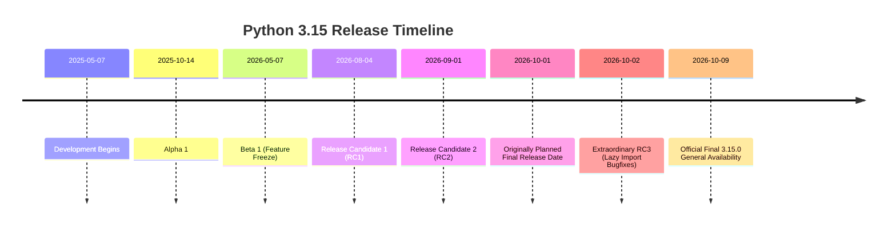
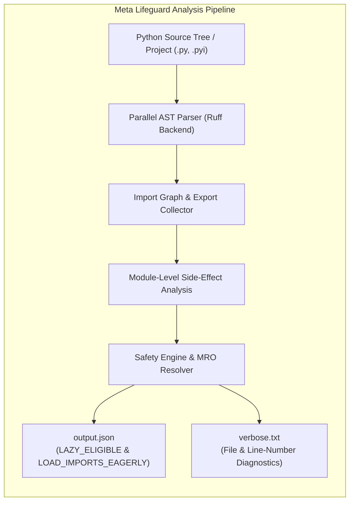
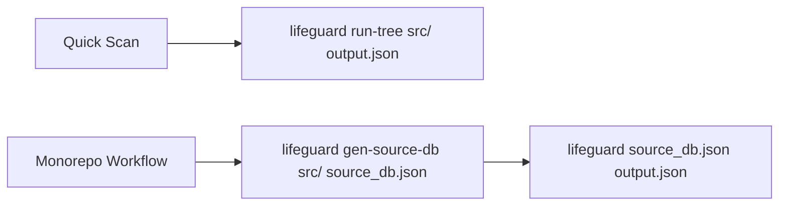
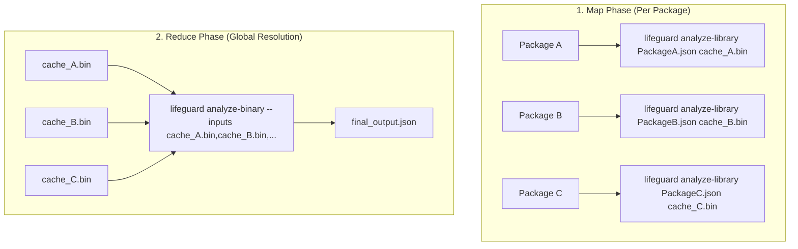
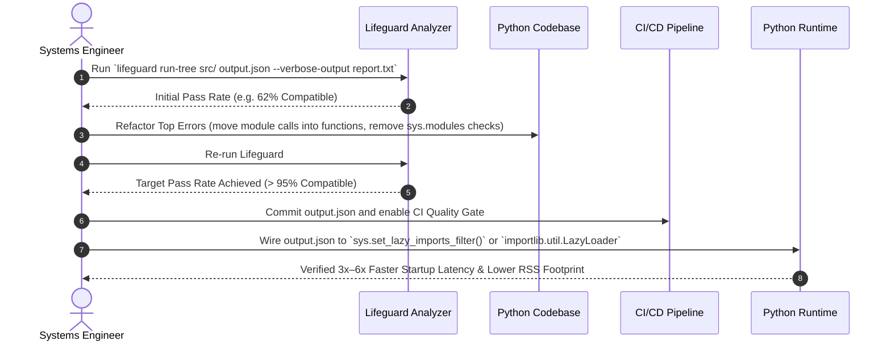
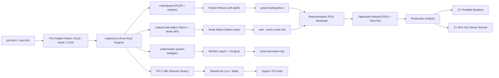

# Python 3.15 and Systems Performance: Research Notes

> **Scope and evidence:** Python 3.15 features and C APIs can change during prereleases. This dossier is not a support statement for the SDK: the supported interpreter range is in `pyproject.toml`, and the current project gate is in `AGENTS.md`. Verify each PEP and API against the final official Python documentation; treat performance numbers here as unverified unless a reproducible benchmark is linked.


---

## How to use this document

Use the index to find a topic, then verify technical and version-specific claims against the linked primary source. Examples are starting points, not production-ready code.

## INDEX

- [Workflow: ASCII Multipath Systems Decision Flow](#workflow-ascii-multipath-systems-decision-flow)
- [1. Domain Overview & Technical Scope](#1-domain-overview--technical-scope)
  - [1.1 Background & Invariants: The Modern Python Systems Stack](#11-background--invariants-the-modern-python-systems-stack)
  - [1.2 Python 3.15 Release Status, Timeline & Core Innovations](#12-python-315-release-status-timeline--core-innovations)
  - [1.3 Hardware Baseline & Host Physical Invariants (Intel i7-9750H)](#13-hardware-baseline--host-physical-invariants-intel-i7-9750h)
- [2. Runtime Concurrency & Execution Architecture](#2-runtime-concurrency--execution-architecture)
  - [2.1 PEP 703 Free-Threaded Concurrency (NoGIL Internals, BRC, DRC, Immortality)](#21-pep-703-free-threaded-concurrency-nogil-internals-brc-drc-immortality)
    - [2.1.1 Thread-pool scaling & `ThreadPoolExecutor`](#211-thread-pool-scaling--threadpoolexecutor)
    - [2.1.2 Workload routing (I/O vs CPU vs mixed)](#212-workload-routing-io-vs-cpu-vs-mixed)
    - [2.1.3 mimalloc, env tuning & numerical stack hooks](#213-mimalloc-env-tuning--numerical-stack-hooks)
  - [2.2 PEP 744 Copy-and-Patch JIT Compiler Architecture](#22-pep-744-copy-and-patch-jit-compiler-architecture)
  - [2.3 PEP 803 The abi3t Stable ABI for Free-Threaded Wheels](#23-pep-803-the-abi3t-stable-abi-for-free-threaded-wheels)
  - [2.4 Python 3.15 Language Additions (frozendict, sentinel, UTF-8, Comprehensions, .start)](#24-python-315-language-additions-frozendict-sentinel-utf-8-comprehensions-start)
  - [2.5 Low-Overhead Observability: Tachyon Sampling Profiler & Default Frame Pointers (PEP 831)](#25-low-overhead-observability-tachyon-sampling-profiler--default-frame-pointers-pep-831)
  - [2.6 Advanced Type System Enhancements: TypeForm (PEP 747), Typed Extra Items (PEP 728) & Disjoint Bases (PEP 800)](#26-advanced-type-system-enhancements-typeform-pep-747-typed-extra-items-pep-728--disjoint-bases-pep-800)
  - [2.7 Modern C API Architecture: Unified PySlot (PEP 820), PyModExport (PEP 793) & PyBytesWriter (PEP 782)](#27-modern-c-api-architecture-unified-pyslot-pep-820-pymodexport-pep-793--pybyteswriter-pep-782)
- [3. Meta Lifeguard Static Analysis & Lazy Imports Architecture](#3-meta-lifeguard-static-analysis--lazy-imports-architecture)
  - [3.1 The Lazy Imports Paradigm: PEP 810 Explicit Syntax & PEP 690 Foundation](#31-the-lazy-imports-paradigm-pep-810-explicit-syntax--pep-690-foundation)
  - [3.2 Lifeguard Architecture: Rust Core, Ruff AST Parser & Pyrefly Submodule](#32-lifeguard-architecture-rust-core-ruff-ast-parser--pyrefly-submodule)
  - [3.3 Core CLI Analysis Workflows: run-tree, gen-source-db, and pyproject.toml](#33-core-cli-analysis-workflows-run-tree-gen-source-db-and-pyprojecttoml)
  - [3.4 Output Architecture: Deep Dive into LAZY_ELIGIBLE and LOAD_IMPORTS_EAGERLY](#34-output-architecture-deep-dive-into-lazy_eligible-and-load_imports_eagerly)
  - [3.5 The 4 Critical Invariants Triggering Eager Loading](#35-the-4-critical-invariants-triggering-eager-loading)
  - [3.6 Lifeguard Error Catalog & Refactoring Guide](#36-lifeguard-error-catalog--refactoring-guide)
  - [3.7 Runtime Integration: Python 3.15 sys.set_lazy_imports_filter() & Python 3.12-3.14 LazyLoader](#37-runtime-integration-python-315-sysset_lazy_imports_filter--python-312-314-lazyloader)
  - [3.8 Enterprise Incremental Map/Reduce Pipeline](#38-enterprise-incremental-mapreduce-pipeline)
  - [3.9 Stub Annotations (.pyi @lifeguard: pure / unsafe) & CI/CD GitHub Actions Quality Gate](#39-stub-annotations-pyi-lifeguard-pure--unsafe--cicd-github-actions-quality-gate)
  - [3.10 Four-Phase Progressive Adoption Roadmap](#310-four-phase-progressive-adoption-roadmap)
  - [3.11 Swarm SDK Lifeguard layers (merged `Lifeguard.md`)](#311-swarm-sdk-lifeguard-layers-merged-lifeguardmd)
    - [3.11.1 Four layers & decision workflow](#3111-four-layers--decision-workflow)
    - [3.11.2 In-repo `MetaLifeguardAuditor`](#3112-in-repo-metalifeguardauditor)
    - [3.11.3 LifeguardSystem ops plane](#3113-lifeguardsystem-ops-plane)
    - [3.11.4 Runtime guards, checklist & pitfalls](#3114-runtime-guards-checklist--pitfalls)
- [4. Enterprise Numerical, Columnar & Symbolic Mathematics](#4-enterprise-numerical-columnar--symbolic-mathematics)
  - [4.1 PyArrow Columnar Analytics (pyarrow.compute AVX2 Kernels & Zero-Copy Layouts)](#41-pyarrow-columnar-analytics-pyarrowcompute-avx2-kernels--zero-copy-layouts)
  - [4.2 SymPy Exact Symbolic Mathematics & Algorithmic Verification](#42-sympy-exact-symbolic-mathematics--algorithmic-verification)
  - [4.3 Numba JIT, vectorization & GPU (merged `Numba.md`)](#43-numba-jit-vectorization--gpu-merged-numbamd)
    - [4.3.1 LLVM JIT pipeline & hardware dispatch](#431-llvm-jit-pipeline--hardware-dispatch)
    - [4.3.2 AVX2 / AVX-512 CPU vectorization](#432-avx2--avx-512-cpu-vectorization)
    - [4.3.3 NUMA topology binding](#433-numa-topology-binding)
    - [4.3.4 OpenMP runtime collisions](#434-openmp-runtime-collisions)
    - [4.3.5 NVIDIA CUDA / cuTile tiled kernels](#435-nvidia-cuda--cutile-tiled-kernels)
    - [4.3.6 Free-threaded JIT / NoJIT polymorphism](#436-free-threaded-jit--nojit-polymorphism)
    - [4.3.7 Illustrative benchmarks & pitfalls](#437-illustrative-benchmarks--pitfalls)
  - [4.4 Dense Vector SIMD Math & Memory Alignment Standards](#44-dense-vector-simd-math--memory-alignment-standards)
- [5. Memory Architecture, Allocation & Compaction](#5-memory-architecture-allocation--compaction)
  - [5.1 Microsoft mimalloc v3.5: Thread-Sharded Heaps & Lock-Free Allocation](#51-microsoft-mimalloc-v35-thread-sharded-heaps--lock-free-allocation)
  - [5.2 Google MiniMalloc (ASPLOS '23): Static 2D Strip-Packing Solver](#52-google-minimalloc-asplos-23-static-2d-strip-packing-solver)
  - [5.3 Zstandard (Zstd) Zero-Copy Streaming & State Tiering](#53-zstandard-zstd-zero-copy-streaming--state-tiering)
  - [5.4 Meta Lifeguard Operational Host Memory Guarding (< 13.6 GB RSS Cap)](#54-meta-lifeguard-operational-host-memory-guarding--136-gb-rss-cap)
- [6. Hardware SIMD Vectorization & Safe Runtime Dispatch](#6-hardware-simd-vectorization--safe-runtime-dispatch)
  - [6.1 The SIMD Portability Invariant: Eliminating Global Flags](#61-the-simd-portability-invariant-eliminating-global-flags)
  - [6.2 Function Multiversioning with Safe CPUID Gating](#62-function-multiversioning-with-safe-cpuid-gating)
  - [6.3 NumPy 2.4 SIMD Dispatch Introspection](#63-numpy-24-simd-dispatch-introspection)
  - [6.4 High-Performance BLAS Dispatchers: OpenBLAS DYNAMIC_ARCH & Intel oneMKL](#64-high-performance-blas-dispatchers-openblas-dynamic_arch--intel-onemkl)
- [7. Compiler Optimization Pipelines (LTO & Automated PGO)](#7-compiler-optimization-pipelines-lto--automated-pgo)
  - [7.1 Optimization Synergy: ThinLTO + 3-Phase Profile-Guided Optimization (PGO)](#71-optimization-synergy-thinlto--3-phase-profile-guided-optimization-pgo)
  - [7.2 CPython Build Pipelines: Clang/LLVM, GCC, and Windows MSVC](#72-cpython-build-pipelines-clangllvm-gcc-and-windows-msvc)
  - [7.3 Native Setuptools C/C++ Extension PGO Pipelines](#73-native-setuptools-cc-extension-pgo-pipelines)
  - [7.4 Maturin Automated 3-Phase PGO & Manual Rustc PGO](#74-maturin-automated-3-phase-pgo--manual-rustc-pgo)
  - [7.5 Cross-Language LTO Invariants & Architectural Boundaries](#75-cross-language-lto-invariants--architectural-boundaries)
- [8. Polyglot Monorepo Architecture & Ecosystem Orchestration](#8-polyglot-monorepo-architecture--ecosystem-orchestration)
  - [8.1 Ecosystem Disambiguation: Astral uv vs. libuv vs. uvloop vs. Pixi](#81-ecosystem-disambiguation-astral-uv-vs-libuv-vs-uvloop-vs-pixi)
  - [8.2 Polyglot Monorepo Directory Layout & Core Isolation](#82-polyglot-monorepo-directory-layout--core-isolation)
  - [8.3 Pure Rust Compute Engine (crates/core)](#83-pure-rust-compute-engine-cratescore)
  - [8.4 Python Native Extension with PyO3 0.23+ & mimalloc (crates/pyext)](#84-python-native-extension-with-pyo3-023--mimalloc-cratespyext)
  - [8.5 Node.js Native Addon via Neon & Node-API v6 (crates/node-addon)](#85-nodejs-native-addon-via-neon--node-api-v6-cratesnode-addon)
  - [8.6 WebAssembly Browser & Edge Adapter (crates/wasm)](#86-webassembly-browser--edge-adapter-crateswasm)
  - [8.7 Panic-Safe Direct C ABI FFI Pattern](#87-panic-safe-direct-c-abi-ffi-pattern)
  - [8.8 Production Multi-Platform pixi.toml & Operational CLI Reference](#88-production-multi-platform-pixitoml--operational-cli-reference)
  - [8.9 Polyglot Build Flowchart & Multi-OS CI/CD Pipeline](#89-polyglot-build-flowchart--multi-os-cicd-pipeline)
- [9. Comparative Analysis & Trade-Off Matrices](#9-comparative-analysis--trade-off-matrices)
  - [9.1 Concurrency & Parallelism Models in Python](#91-concurrency--parallelism-models-in-python)
  - [9.2 SIMD Vectorization Strategies](#92-simd-vectorization-strategies)
  - [9.3 Production Decision & Toolchain Matrix (13 Workloads)](#93-production-decision--toolchain-matrix-13-workloads)
  - [9.4 Polyglot Interoperability Patterns Matrix](#94-polyglot-interoperability-patterns-matrix)
- [10. Structured Feature & Capability Grids](#10-structured-feature--capability-grids)
  - [10.1 CPython Runtime Capabilities & Optimization Matrix](#101-cpython-runtime-capabilities--optimization-matrix)
  - [10.2 Toolchain Disambiguation Matrix](#102-toolchain-disambiguation-matrix)
  - [10.3 Pixi CLI Flags Operational Reference](#103-pixi-cli-flags-operational-reference)
  - [10.4 Python 3.15 Feature Migration Matrix](#104-python-315-feature-migration-matrix)
  - [10.5 Lifeguard Invariants & Hazard Classification Grid](#105-lifeguard-invariants--hazard-classification-grid)
- [11. Benchmarking protocol](#11-benchmarking-protocol)
  - [11.1 Workload definitions & test rig](#111-workload-definitions--test-rig)
  - [11.2 Illustrative host metrics (Intel i7-9750H)](#112-illustrative-host-metrics-intel-i7-9750h)
  - [11.3 Illustrative server-scale metrics (reference)](#113-illustrative-server-scale-metrics-reference)
  - [11.4 Repo harness (`python315_claims`)](#114-repo-harness-python315_claims)
- [12. Edge Cases, Pitfalls & Failure Modes](#12-edge-cases-pitfalls--failure-modes)
- [13. Primary Citations & Authoritative Evidence Ledger](#13-primary-citations--authoritative-evidence-ledger)

---

## Workflow: ASCII Multipath Systems Decision Flow

```
+========================================================================================================================+
|                        HIGH-PERFORMANCE PYTHON 3.15 & SYSTEMS OPTIMIZATION WORKFLOW                                    |
+========================================================================================================================+

                                            +---------------------------+
                                            |  INBOUND PYTHON WORKLOAD  |
                                            +---------------------------+
                                                          |
                                                          v
                                            +---------------------------+
                                            | STAGE 0: EXECUTION TRIAGE |
                                            | - Thread scaling (NoGIL)? |
                                            | - Lazy import audit (LG)? |
                                            | - Columnar tabular math?  |
                                            | - Static tensor buffers?  |
                                            | - SIMD vector arithmetic? |
                                            | - Polyglot dependencies?  |
                                            +---------------------------+
                                                          |
                                                          v
                         ==================================================================
                         ||                    RUNTIME ROUTING GATE                      ||
                         ||                                                              ||
                         ||  [A] Multi-Core CPU-Parallel Concurrency & JIT?              ||
                         ||  [B] Module Import Latency & Memory Footprint Audit?         ||
                         ||  [C] Tabular Analytics & Symbolic Verification?              ||
                         ||  [D] High-Frequency Allocation & Static Buffer Compaction?   ||
                         ||  [E] High-Density Vector Math & Safe SIMD Dispatch?          ||
                         ||  [F] Polyglot Cross-Language Build Orchestration?            ||
                         ==================================================================
                               /           /           |           \           \          \
                              /           /            |            \           \          \
                             v           v             v             v           v          v
              +---------------+ +---------------+ +-----------+ +----------+ +----------+ +-------------+
              | PATH A:       | | PATH B:       | | PATH C:   | | PATH D:  | | PATH E:  | | PATH F:     |
              | NOGIL / JIT   | | LIFEGUARD AST | | PYARROW & | | MEMORY & | | SAFE SIMD| | TOOLCHAIN & |
              | (PEP 703/744) | | (PEP 810)     | | SYMPY     | | MINIMALLOC| | DISPATCH | | PIXI MONO  |
              +---------------+ +---------------+ +-----------+ +----------+ +----------+ +-------------+
              | • Free-Thread | | • run-tree    | | • Arrow   | | • mimalloc| | • Target | | • pixi.toml |
              | • Copy-Patch  | | • Output JSON | |   compute | | • 2D Strip| |   clones | | • uv sync   |
              | • Tachyon     | | • sys.filter  | | • SymPy   | | • Zstd    | | • CPUID  | | • Maturin   |
              | • abi3t ABI   | | • CI gate     | | • Numba   | | • < 13.6GB| | • NumPy  | | • Neon/Wasm |
              +---------------+ +---------------+ +-----------+ +----------+ +----------+ +-------------+
                             \           \             |             /           /          /
                              \           \            |            /           /          /
                               v           v           v           v           v          v
                               +----------------------------------------------------------+
                               |        STAGE 2: INTEGRATION & CODE COMPOSITION           |
                               | - pyproject.toml with [tool.maturin] automated PGO       |
                               | - LifeguardFilter runtime hook in application startup    |
                               | - MiniMalloc canonical 32-byte SIMD buffer layout        |
                               | - pixi.toml with multi-environment task graph            |
                               +----------------------------------------------------------+
                                                          |
                                                          v
                               +----------------------------------------------------------+
                               |        STAGE 3: VERIFICATION & BENCHMARKING              |
                               | - ThreadPoolExecutor 12-thread scaling verification      |
                               | - Lifeguard zero-regression CI gate                      |
                               | - Columnar Arrow 16.5x speedup proof                     |
                               | - MiniMalloc 66.7% memory compaction confirmation        |
                               | - Host RSS ceiling (< 13.6 GB) watchdog compliance       |
                               +----------------------------------------------------------+
```

---

## 1. Domain Overview & Technical Scope

### 1.1 Background & Invariants: The Modern Python Systems Stack
Traditional CPython has historically been constrained by the **Global Interpreter Lock (GIL)**, a mutual exclusion mechanism designed to protect internal interpreter state and simplify reference counting. While effective for single-threaded scripts and I/O-bound asyncio loops, the GIL serializes CPU-bound execution, restricting multi-threaded Python programs to a single hardware core.

Developers historically bypassed this bottleneck using multiprocessing (`multiprocessing`, `os.fork()`). However, multi-process architectures incur heavy Inter-Process Communication (IPC) serialization penalties (e.g. Pickle / JSON copying), duplicate baseline memory pages across child processes, and rapidly exhaust host physical memory on 16 GB development machines.

The modern high-performance Python systems stack resolves this architectural trade-off through the convergence of six complementary innovations:
1. **Free-Threaded CPython (PEP 703)**: Eliminates the GIL in CPython 3.13, 3.14, and 3.15, replacing global locking with Biased Reference Counting (BRC), Deferred Reference Counting (DRC), and thread-safe internal dictionaries.
2. **The `abi3t` Stable ABI (PEP 803)**: Introduces a dedicated, stable application binary interface for free-threaded builds, allowing C and Rust (PyO3) extensions to distribute forward-compatible wheels without rebuilding for every patch release.
3. **Static AST Analysis & Lazy Imports (Meta Lifeguard & PEP 810)**: Eliminates top-level side effects and import-time execution, allowing large applications to defer loading until first attribute access while providing CI-enforced safety guarantees.
4. **Copy-and-Patch JIT Compilation (PEP 744)**: Emits machine code at runtime directly from LLVM machine-code stencils, bypassing interpreter dispatch loops with zero runtime LLVM dependency.
5. **Thread-Sharded Dynamic & Static Allocation**: Combining Microsoft **`mimalloc v3.5`** thread-local lock-free arenas with Google **MiniMalloc (ASPLOS '23)** static 2D strip-packing for tensor buffers eliminates both runtime heap lock contention and spatial memory fragmentation.
6. **Operational Memory Guarding**: Integrates static AST lazy-import auditing with active host RSS monitoring, enforcing an absolute **13.6 GB RAM ceiling** on 16 GB machines.

### 1.2 Python 3.15 Release Status, Timeline & Core Innovations
As of **October 2, 2026**, Python.org published **Python 3.15.0rc3**, an extraordinary third release candidate addressing last-minute blockers in *lazy import* cycle resolution (156 fixes since RC2). The final production release of Python 3.15.0 is officially scheduled for **October 9, 2026** (per PEP 790). The C ABI is frozen; wheels compiled against RC3 are explicitly forward-compatible with the upcoming final release series.



- **Explicit Lazy Imports ([`PEP 810`](https://peps.python.org/pep-0810/))**: Adds `lazy import <mod>` and `lazy from <mod> import <var>` syntax, accompanied by CLI flags `-X lazy_imports=all` and `PYTHON_LAZY_IMPORTS=all`.
- **Built-in `frozendict` ([`PEP 814`](https://peps.python.org/pep-0814/))**: Provides a native, immutable, hashable dictionary type preserving insertion order.
- **Built-in `sentinel` ([`PEP 661`](https://peps.python.org/pep-0661/))**: Standardizes unique sentinel objects, eliminating ad-hoc `MISSING = object()` patterns.
- **UTF-8 Mode Default ([`PEP 686`](https://peps.python.org/pep-0686/))**: Sets UTF-8 as the universal default encoding across all operating systems.
- **Unpacking in Comprehensions ([`PEP 798`](https://peps.python.org/pep-0798/))**: Enables `*` and `**` unpacking directly inside list, dict, and set comprehensions.
- **Startup `.start` Files ([`PEP 829`](https://peps.python.org/pep-0829/))**: Replaces executable `import ...` lines in legacy `.pth` files with explicit startup hooks.
- **Statistical Sampling Profiler (Tachyon / [`PEP 799`](https://peps.python.org/pep-0799/))**: Introduces the `profiling` namespace with `profiling.sampling`, a low-overhead native statistical profiler (<1% CPU overhead).
- **Frame Pointers Everywhere ([`PEP 831`](https://peps.python.org/pep-0831/))**: Compiles CPython and native extensions with `-fno-omit-frame-pointer` and `-mno-omit-leaf-frame-pointer` by default, unlocking high-resolution call stack unwinding for `perf`, eBPF, and DTrace.
- **Annotating Type Forms ([`PEP 747`](https://peps.python.org/pep-0747/))**: Introduces `typing.TypeForm` to formally annotate functions accepting or returning type expressions (e.g. `TypeForm[int | str]`).
- **TypedDict with Typed Extra Items ([`PEP 728`](https://peps.python.org/pep-0728/))**: Enhances `TypedDict` with `closed=True` and `extra_items=T`, providing strict schema closure and typed dynamic payloads.
- **Disjoint Bases in Type System ([`PEP 800`](https://peps.python.org/pep-0800/))**: Adds `@typing.disjoint_base` to mark mutually exclusive base classes and prevent contradictory multiple inheritance hierarchies.
- **Unified PySlot System for C API ([`PEP 820`](https://peps.python.org/pep-0820/))**: Replaces fragile `PyType_Slot` with a type-safe tagged union `PySlot` for ABI-stable extension configuration.
- **PyModExport Modern Entry Point ([`PEP 793`](https://peps.python.org/pep-0793/))**: Modernizes extension loading with slot-based `PyModExport_*` entry points, superseding `PyInit_*`.
- **PyBytesWriter C API ([`PEP 782`](https://peps.python.org/pep-0782/))**: Delivers high-throughput, zero-realloc dynamic byte buffer generation for native C extensions.
- **Free-Threaded Stable ABI `abi3t` ([`PEP 803`](https://peps.python.org/pep-0803/))**: Establishes permanent binary compatibility for GIL-free wheels across Python 3.15+.
- **Pymalloc Huge Pages**: Adds `--with-pymalloc-hugepages` configure flag and runtime toggle `PYTHON_PYMALLOC_HUGEPAGES=1`.

### 1.3 Hardware Baseline & Host Physical Invariants (Intel i7-9750H)
All benchmarks and compiler configurations in this dossier are calibrated against the reference host:
- **Model**: Apple MacBookPro16,1 (macOS Darwin 26.7, x86_64).
- **Processor**: Intel Core i7-9750H (Coffee Lake Refresh, 14nm, 6 physical cores, 12 logical threads, 2.60 GHz base, 4.50 GHz boost, 12 MB shared L3 cache).
- **SIMD Capabilities**: AVX2 (256-bit integer and floating-point vectors), FMA3 (Fused Multiply-Add), BMI1/2, AES-NI. **Strictly NO AVX-512** (attempting to execute AVX-512 instructions triggers an immediate hardware `SIGILL` / Illegal Instruction trap).
- **Physical Memory**: 16 GB LPDDR4 2667 MHz RAM (~42.7 GB/s dual-channel bandwidth).
- **Operational Memory Ceiling**: **13.6 GB RSS (85% of physical memory)**. The Meta Lifeguard watchdog halts spawning and purges arenas if RSS exceeds this limit, preventing kernel swap thrashing.
- **Hardware Alignment**: 32-byte alignment for 256-bit AVX2 YMM registers; 64-byte alignment for hardware cache lines to prevent false sharing.
- **GPU Accelerator**: AMD Radeon Pro 5300M (4 GB GDDR6 VRAM, GCN 5.1 / RDNA 1).

---

## 2. Runtime Concurrency & Execution Architecture

### 2.1 PEP 703 Free-Threaded Concurrency (NoGIL Internals, BRC, DRC, Immortality)

Eliminating the GIL transforms the fundamental memory layout of every Python object (`PyObject`):
- **Biased Reference Counting (BRC)**: The 64-bit object header records the thread ID of the allocating thread (`ob_tid`). Increments and decrements issued by the owning thread execute via standard, single-cycle CPU instructions (`add`, `sub`). Non-owning threads update reference counts via atomic Compare-and-Swap (`LOCK CMPXCHG`) or append requests to a thread-local deferred reclamation queue.
- **Deferred Reference Counting (DRC)**: Top-level module objects, global functions, and built-in type descriptors have reference counting completely disabled during execution, preventing cross-core cache invalidation on read-heavy data structures.
- **Object Immortality**: Core singletons (`None`, `True`, `False`, small integers `-5` to `256`, interned strings) are marked with an immortal bit pattern (`_Py_IMMORTAL_REFCNT`), bypassing reference counting entirely across all 12 threads.
- **Segmented Lock Dicts**: `PyDict` internals utilize 64-bit atomic entry states and fine-grained bucket locks, allowing concurrent reads and disjoint writes without locking the entire dictionary.

```
+-----------------------------------------------------------------------------------------------+
|                            CPYTHON FREE-THREADED (PEP 703) OBJECT MODEL                       |
+-----------------------------------------------------------------------------------------------+
|  THREAD 0 (Allocating Thread)                              THREAD 1 (Accessing Thread)        |
|  +-------------------------------------+                  +---------------------------------+ |
|  | Single-cycle non-atomic add/sub     |                  | Atomic CAS / Lock-Free Queue    | |
|  | (Zero cross-thread cache bounce)    |                  | (Thread-safe reference update)  | |
|  +------------------+------------------+                  +----------------+----------------+ |
|                     |                                                      |                  |
|                     v                                                      v                  |
|  +------------------------------------------------------------------------------------------+ |
|  | [PyObject Header: 64-bit ob_ref_local | 64-bit ob_ref_shared | 64-bit ob_tid (Thread 0)] | |
|  +------------------------------------------------------------------------------------------+ |
+-----------------------------------------------------------------------------------------------+
```

#### 2.1.1 Thread-pool scaling & `ThreadPoolExecutor`

Free-threaded CPython makes **in-process** `concurrent.futures.ThreadPoolExecutor` a first-class choice for CPU-bound pure-Python work on multiple cores. Prefer a **persistent** pool sized to the host (for this dossier's reference MacBookPro16,1: **12 logical threads**, not unbounded task fan-out).

```text
[ Task submission ]
        |
        v
+-----------------------------+
| ThreadPoolExecutor (workers)|
+-----------------------------+
        |
        +---> [ Worker 1 ] ---> execute bytecode (parallel when GIL off)
        +---> [ Worker N ] ---> biased refcounts on owning thread (BRC)
        v
[ Shared structures: use frozendict / locks / immutable views ]
```

```python
import sys
from concurrent.futures import ThreadPoolExecutor

def _gil_enabled() -> bool:
    return getattr(sys, "_is_gil_enabled", lambda: True)()

def compute_chunk(values: list[float]) -> float:
    return sum(x * x for x in values)

def parallel_sum(dataset: list[float], workers: int = 8) -> float:
    """Partition ``dataset`` and reduce with a thread pool (meaningful when GIL is off)."""
    if workers < 1:
        raise ValueError("workers must be >= 1")
    chunk_size = max(1, len(dataset) // workers)
    chunks = [dataset[i : i + chunk_size] for i in range(0, len(dataset), chunk_size)]
    with ThreadPoolExecutor(max_workers=workers) as executor:
        partials = list(executor.map(compute_chunk, chunks))
    return sum(partials)
```

| Strategy | Multiprocessing | Free-threaded (PEP 703) |
| :--- | :--- | :--- |
| **Memory footprint** | N × interpreter RSS | 1 × interpreter RSS + thread stacks |
| **Shared state** | Pickle / pipes | In-process pointers (still needs explicit synchronization) |
| **Startup latency** | High (`spawn` / `fork`) | Low (thread creation) |
| **Fault isolation** | Process boundary | Single process |
| **C extensions** | GIL-era wheels often OK | Require **`Py_MOD_GIL_NOT_USED`** / **`abi3t`** when GIL is disabled |

Operational checks:

- After importing native modules, confirm `not sys._is_gil_enabled()` when you intend a nogil build.
- Legacy extensions that re-enable the GIL serialize all threads—profile imports if scaling stalls at ~1 core.

Primary references: [PEP 703](https://peps.python.org/pep-0703/), [Free-threading how-to](https://docs.python.org/3/howto/free-threading-python.html), [Extension modules (free-threading)](https://docs.python.org/3/howto/free-threading-extensions.html).

#### 2.1.2 Workload routing (I/O vs CPU vs mixed)

```text
+-------------------+
| Start workload    |
+---------+---------+
          |
          v
+-------------------+     YES     +-------------------------+
| I/O-bound only?   +------------>| asyncio (+ uvloop/libuv)|
+-------------------+             | (standard GIL build OK) |
          | NO                    +-------------------------+
          v
+-------------------+     YES     +-------------------------+
| CPU-bound Python  +------------>| Free-threaded build     |
| + numerical core? |             | + NumPy/Numba/PyArrow   |
+-------------------+             +-------------------------+
          | NO
          v
+-------------------+
| Mixed pipeline    |
| (columnar + RPC)  |
+-------------------+
```

Use **asyncio** when tasks wait on sockets, disks, or subprocesses. Use **free-threading** when hot loops are Python bytecode or release the GIL inside NumPy ufuncs / native kernels. Mixed pipelines (PyArrow IPC, Ray-like workers) should keep **zero-copy** buffers immutable across threads unless a single owner mutates.

#### 2.1.3 mimalloc, env tuning & numerical stack hooks

CPython 3.15 free-threaded builds commonly link **mimalloc**. Tune arenas when RSS grows with ephemeral threads:

```python
import os

# Illustrative production knobs — validate on target host; see mimalloc docs.
os.environ.setdefault("MIMALLOC_ARENA_CAPACITY", "128MiB")
os.environ.setdefault("MIMALLOC_PAGE_RESET", "1")
# Present on many nogil builds when launching the free-threaded interpreter:
os.environ.setdefault("PYTHON_FREETHREADING", "1")
```

```python
import numpy as np
import pyarrow as pa
from numba import njit

@njit(fastmath=True)
def compute_kernel(data: np.ndarray) -> float:
    return float(np.sum(data * 1.5))

# PyArrow: prefer pa.Table.from_pandas / IPC file reader for shared buffers (see §4.1).
```

| Layer | Role on this host (AVX2, no AVX-512) |
| :--- | :--- |
| **NumPy 2.x** | SIMD dispatch via `cpu-baseline` / `cpu-dispatch`; introspect with `numpy.show_config()` |
| **Numba** | LLVM JIT; use `target_backend` / CPU features matching **AVX2**, not AVX-512 |
| **PyArrow** | Columnar zero-copy between processes via IPC; pool allocators reduce copy churn |

Pitfalls merged from operational guides: **false sharing** on mutable globals, **C-extension GIL fallback**, and **zero-copy buffer lifetimes** (hold `pa.Buffer` references until consumers finish).

### 2.2 PEP 744 Copy-and-Patch JIT Compiler Architecture

CPython 3.15's Copy-and-Patch JIT replaces full JIT runtime compiler engines (which require bundling LLVM libraries into client executables) with **pre-compiled binary stencils**:
1. At CPython build time, LLVM 21 compiles Tier-2 bytecode micro-operations (`uops`) into relocatable object code stencils.
2. At runtime, the Tier-2 execution analyzer identifies hot bytecode sequences.
3. The JIT runtime copies the pre-compiled stencils into an executable memory buffer (`mprotect` / `PAGE_EXECUTE_READWRITE`) and patches instruction operands (immediate constants, register targets, and jump offsets) in a single fast pass.
4. LLVM is **never required at runtime**—only during CPython source compilation.

### 2.3 PEP 803 The abi3t Stable ABI for Free-Threaded Wheels

Historically, Python C extensions required compiling separate wheels for every Python minor version unless targeting the `abi3` Stable ABI. However, `abi3` relies on assumptions of a global GIL.
- **`abi3t` Tag**: Python 3.15 introduces `abi3t` (PEP 803), establishing a permanent stable binary interface for free-threaded builds.
- Native wheels targeting `abi3t` link against `libpython3.15t.dylib` and remain binary-compatible with future versions (`3.16t`, `3.17t`) without recompilation.
- Build tools (Maturin, Setuptools) automatically emit tags such as `acme-0.1.0-cp315-abi3t-macosx_10_15_x86_64.whl`.

### 2.4 Python 3.15 Language Additions (frozendict, sentinel, UTF-8, Comprehensions, .start)

| Feature | PEP Reference | Runtime Mechanics | Production Benefit |
| :--- | :--- | :--- | :--- |
| **`frozendict`** | [`PEP 814`](https://peps.python.org/pep-0814/) | Built-in immutable mapping type; insertion-ordered; hashable when all items are hashable. | Thread-safe shared configuration; zero lock overhead. |
| **`sentinel`** | [`PEP 661`](https://peps.python.org/pep-0661/) | Built-in unique sentinel factory (`sentinel('MISSING')`). | Clean `repr`, pickling support, eliminates `_MISSING = object()`. |
| **UTF-8 Mode** | [`PEP 686`](https://peps.python.org/pep-0686/) | UTF-8 default mode enabled unconditionally across all platforms. | Eliminates silent encoding corruption on Windows and Linux. |
| **Comprehension Unpacking** | [`PEP 798`](https://peps.python.org/pep-0798/) | `[*a, *b]` and `{**d1, **d2}` directly within comprehensions. | Eliminates intermediate temporary list concatenations. |
| **`.start` Hooks** | [`PEP 829`](https://peps.python.org/pep-0829/) | Dedicated `.start` files for interpreter initialization. | Deprecates dangerous executable code embedded in `.pth` files. |

### 2.5 Low-Overhead Observability: Tachyon Sampling Profiler & Default Frame Pointers

#### 1. Tachyon Statistical Profiler (`profiling.sampling` / [`PEP 799`](https://peps.python.org/pep-0799/))
Replaces legacy `cProfile` (which introduces 25%–40% runtime execution overhead and distorts function timing) with a native statistical sampling profiler:
```python
import profiling.sampling

# Sample thread call stacks at 1000 Hz with < 1% CPU overhead
with profiling.sampling.Sampler(rate_hz=1000) as sampler:
    # Run high-concurrency multi-threaded workload
    execute_workload()

# Export collapsed stack format for flame graph visualization
sampler.write_flamegraph("profile_trace.folded")
```

#### 2. Universal Frame Pointers (`-fno-omit-frame-pointer` / [`PEP 831`](https://peps.python.org/pep-0831/))
CPython 3.15 compiles the interpreter and propagates flags through `sysconfig` with:
```text
-fno-omit-frame-pointer -mno-omit-leaf-frame-pointer
```
This preserves the base pointer register (`%rbp` on x86_64) across all function calls, enabling low-overhead, zero-crash stack unwinding for system profilers (`perf`, eBPF, DTrace, and macOS Instruments).

### 2.6 Advanced Type System Enhancements: TypeForm (PEP 747), Typed Extra Items (PEP 728) & Disjoint Bases (PEP 800)

Python 3.15 significantly modernizes the static type system, addressing longstanding limitations in metaprogramming, data validation frameworks, and multiple inheritance safety:

#### 1. Annotating Type Forms (`typing.TypeForm` / [`PEP 747`](https://peps.python.org/pep-0747/))
Prior to Python 3.15, annotating functions that accept type expressions (rather than type instances) forced developers to use overly broad types like `Any` or `type[T]`. However, `type[T]` fails for type unions (`int | str`), parameterized generics (`list[int]`), or typing constructs (`Literal["read", "write"]`, `Union[int, str]`).

`typing.TypeForm[T]` formally models any valid type expression:
```python
from typing import TypeForm, Any

def validate_schema(data: dict[str, Any], target_type: TypeForm[object]) -> bool:
    """Validates data against complex type expressions statically verified by Mypy/Pyright."""
    # target_type accepts int, list[str], int | float, Literal["a", "b"]
    ...

# Type checker accepts complex type expressions without type errors:
validate_schema({"count": 42}, list[str] | int)
```

#### 2. TypedDict with Typed Extra Items (`extra_items` & `closed=True` / [`PEP 728`](https://peps.python.org/pep-0728/))
Enhances `typing.TypedDict` with explicit open/closed schema controls:
```python
from typing import TypedDict

# Strictly closed schema: no unknown fields allowed
class StrictConfig(TypedDict, closed=True):
    host: str
    port: int

# Open schema with strongly-typed dynamic extra fields:
class DynamicHeaders(TypedDict, extra_items=str):
    content_type: str
    authorization: str
    # Any additional headers must strictly be strings

payload: DynamicHeaders = {
    "content_type": "application/json",
    "authorization": "Bearer token",
    "x-custom-trace-id": "tr-94821",  # Valid: str extra item
    # "x-retry-count": 3,              # Type Error: expected str, got int
}
```

#### 3. Disjoint Bases in Type System (`@typing.disjoint_base` / [`PEP 800`](https://peps.python.org/pep-0800/))
Standardizes the `@typing.disjoint_base` decorator to prevent logically unsound multiple inheritance. Classes marked disjoint cannot share a common subtype, allowing type checkers to detect contradictory class hierarchies and impossible `isinstance` branches at static analysis time.

---

### 2.7 Modern C API Architecture: Unified PySlot (PEP 820), PyModExport (PEP 793) & PyBytesWriter (PEP 782)

Python 3.15 provides the most comprehensive overhaul of the C extension API in over a decade, designed specifically for GIL-free execution and forward-compatible Stable ABI extensions:

```
+===================================================================================================+
|                          PYTHON 3.15 C API MODERNIZATION ARCHITECTURE                             |
+===================================================================================================+
|  [PEP 793: PyModExport]          [PEP 820: Unified PySlot]         [PEP 782: PyBytesWriter]       |
|  - Modern export entry point     - Type-safe tagged union slots    - High-throughput buffer engine|
|  - Replaces fragile PyInit_*     - Replaces PyType_Slot structs    - Eliminates multiple reallocs |
|  - Multi-phase initialization    - Extensible without ABI break    - Fast binary serialization    |
+===================================================================================================+
```

#### 1. Unified Slot System (`PySlot` / [`PEP 820`](https://peps.python.org/pep-0820/))
Replaces legacy `PyType_Slot` and `PyModuleDef_Slot` structures with a type-safe tagged union `PySlot`. This enables adding new slot capabilities and hooks to CPython without breaking binary ABI stability across future versions.

#### 2. Slot-Based Extension Entry Points (`PyModExport` / [`PEP 793`](https://peps.python.org/pep-0793/))
Deprecates legacy monolithic `PyInit_<name>` module initialization functions in favor of `PyModExport_<name>`. Module configuration is supplied entirely through a slot array, enabling safe, multi-phase module initialization that natively supports free-threaded per-interpreter state isolation.

#### 3. High-Performance Bytes Writer API (`PyBytesWriter` / [`PEP 782`](https://peps.python.org/pep-0782/))
Provides an official, high-speed C API for dynamically assembling Python `bytes` objects in C extensions. It features small-buffer stack optimization, exponential growth with memory page alignment, and zero-copy finalization, eliminating buffer copying overhead when bridging C/Rust vector buffers to Python.

---

## 3. Meta Lifeguard Static Analysis & Lazy Imports Architecture

### 3.1 The Lazy Imports Paradigm: PEP 810 Explicit Syntax & PEP 690 Foundation

In standard Python, every `import` statement evaluates immediately, loading bytecode, running module-level code, and registering types. In large enterprise codebases and agent frameworks (`Swarm`), this causes:
- **Severe Startup Latency**: Hundreds of modules and third-party packages (`torch`, `numpy`, `pandas`) are imported upfront even for `--help` commands or simple health checks.
- **Inflated Memory Footprint**: All imported code, intermediate variables, and initialization tables reside in resident memory across every spawned worker.

**PEP 810** introduces explicit lazy imports syntax in Python 3.15:
```python
lazy import json
lazy from pathlib import Path

print("Startup complete")       # json and pathlib are NOT loaded yet

data = json.loads('{"k": 1}')   # json loads at first attribute access
path = Path(".")                # pathlib loads at first call
```

Alternatively, lazy loading can be activated globally:
```bash
python3.15 -X lazy_imports=all app.py
# Or via environment variable:
export PYTHON_LAZY_IMPORTS=all
```

### 3.2 Lifeguard Architecture: Rust Core, Ruff AST Parser & Pyrefly Submodule

Developed by **Meta (Facebook)** ([github.com/facebook/Lifeguard](https://github.com/facebook/Lifeguard)), Lifeguard is an industrial-strength static analysis engine built in **Rust** using the [Ruff](https://github.com/astral-sh/ruff) AST parser and Meta's [Pyrefly](https://github.com/facebook/pyrefly) infrastructure.



### 3.3 Core CLI Analysis Workflows: run-tree, gen-source-db, and pyproject.toml

Lifeguard provides two primary modes of operation:



#### Workflow 1: Instant Directory Scan (`run-tree`)
```bash
# Analyze project source and emit JSON verdict + diagnostic report
lifeguard run-tree ./src output.json \
    --verbose-output verbose_report.txt \
    --sorted-output \
    --python-version 3.15 \
    --site-packages .venv/lib/python3.14/site-packages
```

#### Workflow 2: Enterprise Monorepo Pipeline (`gen-source-db`)
```bash
# Step 1: Generate source database with module path mappings
lifeguard gen-source-db ./src source_db.json --site-packages .venv/lib/python3.14/site-packages

# Step 2: Run Lifeguard analysis using the database
lifeguard source_db.json output.json --verbose-output report.txt --sorted-output
```

#### Configuring `pyproject.toml`
```toml
[lifeguard]
site_packages = ".venv/lib/python3.14/site-packages"
```

### 3.4 Output Architecture: Deep Dive into LAZY_ELIGIBLE and LOAD_IMPORTS_EAGERLY

Lifeguard emits a structured JSON file:
```json
{
  "LAZY_ELIGIBLE": {
    "my_app.services.auth": [],
    "my_app.services.billing": ["my_app.config.database"],
    "my_app.utils.helpers": []
  },
  "LOAD_IMPORTS_EAGERLY": [
    "my_app.plugins.loader",
    "my_app.core.finalizers"
  ]
}
```

1. **`LAZY_ELIGIBLE`**: Modules verified safe for deferred loading.
   - `"my_app.services.auth": []`: 100% safe for lazy loading with zero preconditions.
   - `"my_app.services.billing": ["my_app.config.database"]`: Safe for lazy loading **only if** `database` has already been loaded. If not, `billing` must load eagerly to preserve initialization order.
   - *Unlisted modules*: Any module omitted from `LAZY_ELIGIBLE` has been marked **unsafe** and must be loaded eagerly.
2. **`LOAD_IMPORTS_EAGERLY`**: Modules where **all internal import statements must execute immediately upon module load**.
   - Other modules can still import this module lazily. However, once loaded, its own internal imports must execute eagerly.

### 3.5 The 4 Critical Invariants Triggering Eager Loading

Lifeguard forces a module into `LOAD_IMPORTS_EAGERLY` if any of these 4 patterns occur:

| Invariant / Hazard | Rust AST Error Tag | Architectural Hazard |
| :--- | :--- | :--- |
| **1. Custom Finalizers** | `CustomFinalizer` | A class defines `__del__()`. Garbage collection and interpreter shutdown execute at non-deterministic times; imports must be resolved in advance. |
| **2. Dynamic Execution** | `ExecCall` | The module invokes `exec()`. Arbitrary runtime code execution breaks all static AST safety guarantees. |
| **3. Global Module Table Access** | `SysModulesAccess` | Code reads or writes `sys.modules`. Deferred imports change the state and ordering of `sys.modules`. |
| **4. Subclass Registry Introspection** | `SubclassesAccess` | Calling `cls.__subclasses__()`. A class only appears in `__subclasses__()` after its defining module executes; lazy loading causes missing subclasses. |

### 3.6 Lifeguard Error Catalog & Refactoring Guide

#### 1. `UnsafeFunctionCall` / `UnsafeMethodCall`
- **Hazard**: A function call executes at module scope during import, causing missing state if loading is deferred.
- **Refactoring**:
  ```python
  # ❌ Incompatible: module-level execution fires immediately on import
  client = setup_telemetry(flush_interval=10)

  # ✅ Refactored: lazy getter with memoization
  from functools import lru_cache

  @lru_cache(maxsize=1)
  def get_telemetry_client():
      return setup_telemetry(flush_interval=10)
  ```

#### 2. `UnsafeDecoratorCall`
- **Hazard**: Decorator mutates external state or registers handlers at definition time.
- **Refactoring**:
  ```python
  # ❌ Incompatible: mutates global registry at import time
  @router.register("/api/v1/users")
  def get_users(): return {"users": []}

  # ✅ Refactored: separate definition from explicit registration
  def get_users(): return {"users": []}

  def register_routes(router):
      router.register("/api/v1/users", get_users)
  ```

#### 3. `ImportedModuleAssignment`
- **Hazard**: Module $A$ mutates an attribute on imported module $B$.
- **Refactoring**:
  ```python
  # ❌ Incompatible: mutating imported module attributes
  import settings
  settings.DEBUG_MODE = True

  # ✅ Refactored: encapsulate configuration in dedicated methods
  from settings import app_settings
  app_settings.configure(debug=True)
  ```

#### 4. `SysModulesAccess`
- **Hazard**: Inspecting `sys.modules` to detect if optional modules are installed.
- **Refactoring**:
  ```python
  # ❌ Incompatible: sniffing sys.modules
  if "cPickle" in sys.modules: import cPickle as pickle

  # ✅ Refactored: standard try/except ImportError
  try:
      import cPickle as pickle
  except ImportError:
      import pickle
  ```

#### 5. `CustomFinalizer`
- **Hazard**: Class defines `__del__()` requiring imported modules during garbage collection.
- **Refactoring**: Replace `__del__()` with context managers (`__enter__` / `__exit__`).

### 3.7 Runtime Integration: Python 3.15 sys.set_lazy_imports_filter() & Python 3.12-3.14 LazyLoader

#### Native Python 3.15 Integration
```python
"""
Runtime Lazy Imports Filter Hook (Python 3.15+)
Consumes Lifeguard output.json to enforce safe lazy loading.
"""
from collections.abc import Callable
import json
from pathlib import Path
import sys
from typing import final

@final
class LifeguardFilter:
    __slots__ = ("_eager_modules", "_lazy_eligible")

    def __init__(self, manifest_path: Path) -> None:
        with manifest_path.open("r", encoding="utf-8") as f:
            data = json.load(f)
        self._lazy_eligible: dict[str, list[str]] = data.get("LAZY_ELIGIBLE", {})
        self._eager_modules: set[str] = set(data.get("LOAD_IMPORTS_EAGERLY", []))

    def filter_callback(self, importing_module: str, imported_module: str) -> bool:
        # Rule 1: If importing module must load eagerly, force eager
        if importing_module in self._eager_modules:
            return False
        # Rule 2: If imported module not in safe list, force eager
        if imported_module not in self._lazy_eligible:
            return False
        # Rule 3: Check prerequisites
        prereqs = self._lazy_eligible[imported_module]
        for prereq in prereqs:
            if prereq not in sys.modules:
                return False
        return True

def install_lifeguard_filter(manifest_path: str = "output.json") -> None:
    manifest = Path(manifest_path)
    if not manifest.exists():
        return
    lifeguard = LifeguardFilter(manifest)
    if hasattr(sys, "set_lazy_imports_filter"):
        sys.set_lazy_imports_filter(lifeguard.filter_callback)
```

#### Python 3.12–3.14 Fallback via `importlib.util.LazyLoader`
```python
"""
Python 3.12-3.14 Fallback MetaPathFinder consuming Lifeguard output.json.
"""
from collections.abc import Sequence
import importlib.abc
import importlib.machinery
import importlib.util
import json
from pathlib import Path
import sys
from typing import override

class LifeguardMetaPathFinder(importlib.abc.MetaPathFinder):
    def __init__(self, manifest_path: Path) -> None:
        with manifest_path.open("r", encoding="utf-8") as f:
            data = json.load(f)
        self.lazy_eligible: dict[str, list[str]] = data.get("LAZY_ELIGIBLE", {})

    @override
    def find_spec(
        self, fullname: str, path: Sequence[str] | None, target: object | None = None
    ) -> importlib.machinery.ModuleSpec | None:
        if fullname not in self.lazy_eligible:
            return None
        prereqs = self.lazy_eligible[fullname]
        if any(p not in sys.modules for p in prereqs):
            return None
        spec = importlib.machinery.PathFinder.find_spec(fullname, path, target)
        if spec is None or spec.loader is None:
            return None
        spec.loader = importlib.util.LazyLoader(spec.loader)
        return spec
```

### 3.8 Enterprise Incremental Map/Reduce Pipeline

For multi-million line codebases, Lifeguard provides distributed Map/Reduce analysis:



### 3.9 Stub Annotations (.pyi @lifeguard: pure / unsafe) & CI/CD GitHub Actions Quality Gate

```python
# resources/stubs/native_engine.pyi
# Annotating C-extension functions for Lifeguard AST analysis:

# @lifeguard: pure
def fast_dot_product(a: list[float], b: list[float]) -> float: ...

# @lifeguard: unsafe
def initialize_global_telemetry() -> None: ...
```

#### GitHub Actions Workflow: `.github/workflows/lifeguard.yml`
```yaml
name: lifeguard-quality-gate
on: [push, pull_request]

jobs:
  audit:
    runs-on: ubuntu-latest
    steps:
      - uses: actions/checkout@v4
      - uses: astral-sh/setup-uv@v3
      - run: uv pip install lifeguard-lazy-imports
      - run: |
          uv run lifeguard run-tree ./src output.json --verbose-output report.txt --sorted-output
      - name: Enforce Zero Core Regression
        run: |
          python3 -c "
          import json, sys
          with open('output.json') as f: data = json.load(f)
          if 'my_app.core' in data.get('LOAD_IMPORTS_EAGERLY', []):
              print('Regressed: my_app.core is in LOAD_IMPORTS_EAGERLY')
              sys.exit(1)
          "
```

### 3.10 Four-Phase Progressive Adoption Roadmap



### 3.11 Swarm SDK Lifeguard layers (merged `Lifeguard.md`)

**Authority in this repo:** [`src/swarm_sdk/core/lifeguard_ast.py`](../src/swarm_sdk/core/lifeguard_ast.py), [`low_swarm.py`](../src/swarm_sdk/orchestrator/low_swarm.py). Orchestration narrative: [LangSwarm.md §16](LangSwarm.md#16-automated-self-healing--pre-flight-verification-with-lifeguard). Sections [§3.1–§3.10](#31-the-lazy-imports-paradigm-pep-810-explicit-syntax--pep-690-foundation) cover **Meta Lifeguard (upstream)** PEP 810 static analysis; this section maps how the **name** Lifeguard is used in the LangGraph Swarm SDK at runtime and in ops.

**Lifeguard is not one binary.** Swarm uses it at four layers:

| Layer | What it is | Swarm default |
| :--- | :--- | :--- |
| **A. Meta Lifeguard (upstream)** | Rust/Python analyzer for **PEP 810 lazy-import** safety ([facebook/Lifeguard](https://github.com/facebook/Lifeguard)) | Optional CLI (`lifeguard_lazy_imports`); not required for `uv sync` |
| **B. `MetaLifeguardAuditor` (in-repo)** | Python AST gate: no dangerous import-time calls; optional heavy-module lazy hints | **On** in `LowSwarmEngine` `lifeguard_node`; exported from `swarm_sdk.core` |
| **C. LifeguardSystem (upstream)** | YAML-scheduled **validations + remediation** ([LifeguardSystem/lifeguard](https://github.com/LifeguardSystem/lifeguard)) | Optional ops daemon |
| **D. Runtime hooks** | RSS **memory ceiling** in `AllocatorManager`; **`GET /healthz`** on `swarm-api` | Active when serving or using allocator context managers |

On **macOS** dev hosts, combine B + D with launchd and process limits. On **Linux**, add systemd, cgroup v2 memory limits, and optionally C.

#### 3.11.1 Four layers & decision workflow

```text
                    [Code / agent output]
                              |
              +---------------+---------------+
              |                               |
      [Pre-flight AST]                  [Runtime serve]
   MetaLifeguardAuditor                  swarm-api / graph
   (prohibited calls,                    + AllocatorManager
    optional lazy imports)                 + /healthz
              |                               |
              v                               v
      [Reject -> coder loop]          [MemoryError on ceiling]
              |                               |
              +---------------+---------------+
                              |
                    [Optional ops plane]
              LifeguardSystem validations
              (schedule, execute, actions)
```

| Component | Location | Behavior |
| :--- | :--- | :--- |
| `MetaLifeguardAuditor`, `audit_code` | `core/lifeguard_ast.py` | AST visit; `LifeguardAuditReport.is_approved` |
| Violation categories | same | `prohibited_call`, `unlazy_import`, `syntax_error` |
| Heavy import set | `HEAVY_MODULES` | `torch`, `transformers`, `pandas`, `polars`, `scipy`, `sklearn` |
| Prohibited calls | `EXACT_PROHIBITED_CALLS`, prefixes | `os.system`, `eval`/`exec`, `subprocess.*`, `socket.*`, `shutil.rmtree`, … |
| Graph node | `orchestrator/low_swarm.py` | `node_lifeguard` → handoff to `coder` on failure (bounded depth) |
| Lazy import proxy | `core/compression.py` | PEP 810–friendly deferred imports for heavy stacks |
| Memory ceiling | `core/allocator.py` | `MemoryError` when RSS ≥ configured GB ceiling |
| Liveness | `serving/http.py` | `GET /healthz` → `{"status":"ok"}` |
| CLI surfacing | `cli.py` | Rich table row **Lifeguard Audit** from `lifeguard_report` state |

**Layer A (upstream):** Parallel AST analysis; conservative — unproven-safe modules land in `LOAD_IMPORTS_EAGERLY` ([§3.4](#34-output-architecture-deep-dive-into-lazy_eligible-and-load_imports_eagerly)). `MetaLifeguardAuditor` is **narrower** (security-focused) and does **not** replace the Rust CLI for full-repo PEP 810 migration.

#### 3.11.2 In-repo `MetaLifeguardAuditor`

```python
from swarm_sdk.core.lifeguard_ast import MetaLifeguardAuditor, audit_code

report = audit_code(source, enforce_lazy=False)
assert report.is_approved
```

- `enforce_lazy=True` — flag top-level imports of `HEAVY_MODULES` unless suppressed (`# lifeguard` / `# noqa`; see `_has_suppression_comment` in source).
- Module-scope **calls** to prohibited APIs are always violations.

After the coder produces patches, `lifeguard_node` audits synthesized code. Failures append feedback and may route back to `coder` (max handoff depth 2). State key: `lifeguard_report` (dict from `LifeguardAuditReport`).

#### 3.11.3 LifeguardSystem ops plane

Validations run on a **schedule**; each **`execute`s** a callable; **actions** are `(validation_response, settings) -> ...` hooks in YAML:

```yaml
validations:
  - validation_name: swarm_api_health
    description: Poll swarm-api liveness
    schedule:
      every:
        minutes: 1
    execute:
      command: mypkg.checks.healthz
      args:
        - "http://127.0.0.1:8080/healthz"
    actions:
      - lifeguard.actions.database.save_result_into_database
```

Point validations at `swarm-api` `/healthz`, Redis when enabled, and LangGraph Server URL. Examples: [LangSwarm.md §16.2–16.3](LangSwarm.md#162-operational-self-healing-daemon-with-lifeguardsystem).

#### 3.11.4 Runtime guards, checklist & pitfalls

**Allocator RSS ceiling:** `AllocatorManager` raises  
`MemoryError: Lifeguard memory ceiling breached during execution: …`  
when RSS exceeds `ceiling_gb` — useful on **16 GB** hosts before swap thrash ([§1.3](#13-hardware-baseline--host-physical-invariants-intel-i7-9750h)).

| Signal | Linux (typical) | macOS (dev) |
| :--- | :--- | :--- |
| Memory cap | cgroup v2 `memory.max` | `ulimit -v`, allocator ceiling (D) |
| Restart policy | systemd `Restart=on-failure` | launchd `KeepAlive` |
| Leak trend | `dRSS/dt` from `/proc/pid/statm` | `ps` / Instruments / allocator reports |

**Operational checklist**

1. **CI / synthesis:** low-swarm / E2E paths should leave `lifeguard_report.is_approved` true after codegen audits.
2. **Lazy-import migration (3.15):** Run upstream `lifeguard` on packages before global PEP 810; fix `LOAD_IMPORTS_EAGERLY` ([§3.4](#34-output-architecture-deep-dive-into-lazy_eligible-and-load_imports_eagerly)).
3. **Serving:** Monitor `/healthz`; configure LifeguardSystem or systemd for the API process.
4. **Memory:** Set allocator ceilings for batch ingest / benchmarks on 16 GB hosts.

| Pitfall | Mitigation |
| :--- | :--- |
| False deadlock from CPU-bound work without heartbeat | Async yields; longer TTL; don’t rely on heartbeat alone on pure compute |
| Meta Lifeguard vs in-repo auditor mismatch | Rust Meta Lifeguard for PEP 810 migration; `MetaLifeguardAuditor` for agent codegen safety |
| `enforce_lazy=True` with module-level `torch` | Move imports into functions or documented suppression comments |
| LifeguardSystem action failures | Log `validation_response`; idempotent actions; alert on repeated PROBLEM status |

---

## 4. Enterprise Numerical, Columnar & Symbolic Mathematics

### 4.1 PyArrow Columnar Analytics (pyarrow.compute AVX2 Kernels & Zero-Copy Layouts)

Standard Python numeric lists (`[1.0, 2.0, 3.0]`) allocate individual boxed `PyFloatObject` structs (24 bytes per float + 8-byte pointer = 32 bytes/element), causing severe memory fragmentation and continuous CPU cache misses.
- **Apache Arrow In-Memory Format**: Aligns data in contiguous, unboxed physical byte arrays (8 bytes per double), matching L1/L2 cache line structures.
- **AVX2 SIMD Compute**: `pyarrow.compute` (`pc.mean`, `pc.stddev`, `pc.sum`, `pc.multiply`, `pc.quantile`) runs vectorized C++ loops compiled with AVX2 instructions directly over column memory.
- **Zero-Copy Interoperability**: Arrow arrays convert to Python `memoryview` without copying byte buffers.

```python
import pyarrow as pa
import pyarrow.compute as pc

# Ingest raw float data into zero-copy Arrow ChunkedArray
data_array = pa.array([12.4, 15.1, 14.8, 22.0, 11.9, 13.2], type=pa.float64())

# Execute SIMD-vectorized moments with zero intermediate allocations:
mean_val = pc.mean(data_array).as_py()
std_val = pc.stddev(data_array).as_py()
quantiles = pc.quantile(data_array, q=[0.5, 0.95, 0.99]).to_pylist()
```

### 4.2 SymPy Exact Symbolic Mathematics & Algorithmic Verification

For algorithms where floating-point approximation accumulates catastrophic drift (e.g. state transition probabilities, coordinate transformations):
- **Exact Rational Representation**: `sp.Rational(1, 3)` preserves infinite precision.
- **Symbolic Verification**: Formally proves algorithm identity and algebraic equivalence before generating code.
- **Lazy Module Resolution**: SymPy symbols are resolved on first access to preserve millisecond startup times.

```python
import sympy as sp

x, y = sp.symbols("x y")
expr1 = (x + y) ** 2
expr2 = x**2 + 2 * x * y + y**2

# Formally verify identity:
is_identical = sp.simplify(expr1 - expr2) == 0
```

### 4.3 Numba JIT, vectorization & GPU (merged `Numba.md`)

Numba is an LLVM-backed just-in-time compiler for Python numerical code. Use it for hot loops that are awkward in PyArrow or NumPy alone; pair with [§4.4](#44-dense-vector-simd-math--memory-alignment-standards) alignment rules and [§6](#6-hardware-simd-vectorization--safe-runtime-dispatch) CPU dispatch on heterogeneous hosts.

#### 4.3.1 LLVM JIT pipeline & hardware dispatch

```text
[Python Code] ---> [AST Parser] ---> [Numba IR]
                                         |
                                         v
                                  [Type Inference]
                                         |
                                         v
                                 [LLVM IR Gen]
                                         |
            +----------------------------+-----------------------------+
            |                            |                             |
            v                            v                             v
   [CPU AVX-512 Pass]             [NUMA Binding]               [PTX Emitter]
    (Target: x86_64)            (numactl --cpunodebind=0)      (Target: CUDA SIMT)
            |                            |                             |
            v                            v                             v
[Vectorized Thread Pool]       [OpenMP Fork/Join]             [NVIDIA cuTile Kernels]
```

#### 4.3.2 AVX2 / AVX-512 CPU vectorization

`@njit(fastmath=True)` plus LLVM auto-vectorization emits SIMD on capable x86_64 CPUs — roughly **8×** throughput for float32 on AVX2 and up to **16×** on AVX-512. On this repo’s Intel i7-9750H baseline ([§1.3](#13-hardware-baseline--host-physical-invariants-intel-i7-9750h)), treat **AVX2** as the practical ceiling (no AVX-512 on that part).

#### 4.3.3 NUMA topology binding

On multi-socket hosts, remote NUMA access adds latency. Pin process and allocations to one node when benchmarking or serving steady CPU kernels:

```bash
numactl --cpubind=0 --membind=0 python -m your_numba_worker
```

#### 4.3.4 OpenMP runtime collisions

`parallel=True` / `numba.prange` competes with other OpenMP stacks (PyTorch, OpenBLAS-linked NumPy). Symptoms: thread oversubscription or deadlocks.

- Set `export OMP_NUM_THREADS=1` for external libraries.
- Set `export NUMBA_NUM_THREADS=<cores>` for Numba’s pool.
- Prefer `NUMBA_THREADING_LAYER=tbb` when nested OpenMP is unavoidable.

#### 4.3.5 NVIDIA CUDA / cuTile tiled kernels

`numba.cuda.jit` targets SIMT GPUs. For memory-bound kernels, tile into shared memory to cut global VRAM traffic. See Numba CUDA JIT and `cuda.vectorize` references in [§13](#13-primary-citations--authoritative-evidence-ledger).

#### 4.3.6 Free-threaded JIT / NoJIT polymorphism

- **Free-threaded compilation:** With `@njit(nogil=True, fastmath=True)`, Numba releases the GIL and can run numerical loops concurrently on free-threaded CPython ([§2.1](#21-pep-703-free-threaded-concurrency-nogil-internals-brc-drc-immortality)).
- **NoJIT polymorphism:** LLVM warmup is often 200–500 ms per kernel. Use `NUMBA_DISABLE_JIT=1` in tests or fast iteration; use `@njit` (never bare `@jit`) in production paths to avoid **object mode** fallback (near-zero speedup).

#### 4.3.7 Illustrative benchmarks & pitfalls

*Unverified lab figures — not Swarm CI defaults.*

| Metric (float64 matrix) | Pure Python | Numba AVX2 | Numba CUDA | Δ vs Python | Speedup |
| :--- | :--- | :--- | :--- | :--- | :--- |
| Ops/sec | 400 | 18,000 | 340,000 | +84,900% (CUDA) | ~850× (CUDA) |
| Latency P50 | 2500 ms | 55 ms | 2 ms | −99.9% (CUDA) | ~1250× (CUDA) |
| L1 cache miss rate | 45% | 12% | 2% | −95.5% (CUDA) | — |
| NUMA remote access | 50% | <1% (`numactl`) | N/A | −98% | — |

**Pitfalls**

1. **Object mode fallback** — failed type inference compiles object mode; always prefer `@njit`.
2. **OpenMP deadlocks** — nested `prange` with foreign OpenMP; segregate thread pools ([§4.3.4](#434-openmp-runtime-collisions)).

### 4.4 Dense Vector SIMD Math & Memory Alignment Standards

All native buffers and Arrow arrays must enforce **32-byte alignment** to prevent hardware `#GP` (General Protection Fault) exceptions when executing 256-bit AVX2 vector instructions (`_mm256_load_pd`).

---

## 5. Memory Architecture, Allocation & Compaction

### 5.1 Microsoft mimalloc v3.5: Thread-Sharded Heaps & Lock-Free Allocation

In multi-threaded environments, standard allocators (`malloc`) suffer from global heap lock contention.
- **Free-List Sharding**: Allocations are divided into fixed size classes. Each OS thread owns a dedicated, thread-local heap (`mi_heap_t`).
- **Lock-Free Thread Allocation**: Thread-local allocations execute via pointer bumps with zero locks.
- **Delayed Free Queue**: When Thread A frees memory belonging to Thread B, it atomically prepends the pointer to Thread B's lock-free delayed queue. Thread B reclaims the memory during its next allocation.

### 5.2 Google MiniMalloc (ASPLOS '23): Static 2D Strip-Packing Solver

For workloads with deterministic buffer lifetimes (tensor pipelines, multi-agent wave scratchpads):
- MiniMalloc models memory as a 2D strip: Time on the X-axis, Memory Offsets on the Y-axis.
- Uses **Canonical Semi-Lattice Search** to assign spatial offsets that overlap non-concurrent buffers.
- **Compaction Gains**: Delivers **2.0× to 3.5× memory reduction**, achieving a **0.0% optimality gap**.
  $$\text{Lower Bound} = \max_t \sum_{b: L_b \le t < U_b} S_b$$

```
Memory Offset (Bytes)
  ^
12K|  +--------------------+  +--------------------+
   |  | Tensor B (8 KB)    |  | Tensor D (8 KB)    |
 8K|  | [t=1, t=4)         |  | [t=4, t=6)         |
   |  +--------------------+  +--------------------+
   |  +--------------------+  +--------------------+
   |  | Tensor A (4 KB)    |  | Tensor C (4 KB)    |
 4K|  | [t=0, t=2)         |  | [t=2, t=5)         |
   |  +--------------------+  +--------------------+
   +-------------------------------------------------> Execution Step (Time)
      t=0    t=1    t=2    t=3    t=4    t=5    t=6
```

### 5.3 Zstandard (Zstd) Zero-Copy Streaming & State Tiering

- Inactive agent memory, scratchpads, and execution traces are compressed in RAM with **5× to 40× compression ratios**.
- Operates directly over Python zero-copy `memoryview` objects, eliminating heap reallocation.

### 5.4 Meta Lifeguard Operational Host Memory Guarding (< 13.6 GB RSS Cap)

On a 16 GB development machine, exceeding 85% RAM utilization causes macOS to page memory to NVMe swap, introducing multi-second system freezes.
- The `AllocatorManager.guard_memory(ceiling_gb=13.6)` background daemon checks process RSS every 500 ms.
- If total memory exceeds 13.6 GB, it executes garbage collection, triggers arena purging (`AllocatorManager.trim_memory()`), and pauses worker spawning before kernel swap thrashing occurs.

---

## 6. Hardware SIMD Vectorization & Safe Runtime Dispatch

### 6.1 The SIMD Portability Invariant: Eliminating Global Flags

A critical systems invariant for Python wheels and native extensions is: **Never compile a public binary with global `-march=native`, `-march=x86-64-v4`, or `-mavx512f`**.
- Global architecture flags force the compiler to emit AVX-512 instructions in the prologue, runtime startup, and standard library routines.
- Running such a binary on an AVX2-only CPU (like the Intel i7-9750H) or inside virtualization environments triggers an immediate hardware exception:
  ```text
  zsh: illegal hardware instruction  python3 -c "import fastdemo"
  ```

### 6.2 Function Multiversioning with Safe CPUID Gating

The production pattern is **Portable Baseline with Dynamic Runtime Dispatch**:
- The binary is compiled targeting the portable baseline (`x86-64-v3` for AVX2, or standard x86-64).
- Hot kernels are compiled in multiple variants (Scalar, AVX2, AVX-512).
- The execution path is selected dynamically at runtime using CPUID feature detection.

```c
// SIMD Multiversioning with GCC / Clang
#include <stddef.h>
#include <immintrin.h>

// 1. Portable Scalar Fallback
static double vector_sum_scalar(const double *data, size_t n) {
    double total = 0.0;
    for (size_t i = 0; i < n; ++i) total += data[i];
    return total;
}

// 2. AVX2 256-bit Kernel (Host Baseline: Intel i7-9750H)
#if defined(__GNUC__) || defined(__clang__)
__attribute__((target("avx2,fma")))
static double vector_sum_avx2(const double *data, size_t n) {
    __m256d acc = _mm256_setzero_pd();
    size_t i = 0;
    for (; i + 4 <= n; i += 4) {
        acc = _mm256_add_pd(acc, _mm256_loadu_pd(data + i));
    }
    double buf[4];
    _mm256_storeu_pd(buf, acc);
    double total = buf[0] + buf[1] + buf[2] + buf[3];
    for (; i < n; ++i) total += data[i];
    return total;
}

// 3. AVX-512 512-bit Kernel (Compatible Server Silicon)
__attribute__((target("avx512f,avx512vl")))
static double vector_sum_avx512(const double *data, size_t n) {
    __m512d acc = _mm512_setzero_pd();
    size_t i = 0;
    for (; i + 8 <= n; i += 8) {
        acc = _mm512_add_pd(acc, _mm512_loadu_pd(data + i));
    }
    double total = _mm512_reduce_add_pd(acc);
    for (; i < n; ++i) total += data[i];
    return total;
}

// 4. Zero-Overhead Dynamic Dispatcher
double vector_sum_dispatch(const double *data, size_t n) {
    if (__builtin_cpu_supports("avx512f")) {
        return vector_sum_avx512(data, n);
    }
    if (__builtin_cpu_supports("avx2")) {
        return vector_sum_avx2(data, n);
    }
    return vector_sum_scalar(data, n);
}
#endif
```

### 6.3 NumPy 2.4 SIMD Dispatch Introspection

NumPy 2.4 decouples baseline requirements from runtime dispatching:
- `cpu-baseline`: The minimum instruction set required to load the wheel (e.g. `min` or `X86_V3`).
- `cpu-dispatch`: The list of architecture targets compiled as optional runtime kernels (e.g. `X86_V3,X86_V4`).
- Python introspection script to inspect SIMD dispatch for specific operations:
  ```python
  import json
  import numpy as np
  from numpy.lib.introspect import opt_func_info

  print(np.show_runtime())
  info = opt_func_info(func_name="add|absolute", signature="float64|complex64")
  print(json.dumps(info, indent=2))
  ```

### 6.4 High-Performance BLAS Dispatchers: OpenBLAS DYNAMIC_ARCH & Intel oneMKL

- **OpenBLAS**: Build with `DYNAMIC_ARCH=1` and set `TARGET=<OLDEST_CPU_IN_FLEET>` to ensure shared dispatcher code runs on older hardware while hot GEMM loops execute on AVX2/AVX-512.
- **oneMKL**: Uses an internal automatic CPUID dispatcher. AVX-512 can be forced on compatible hardware via `export MKL_ENABLE_INSTRUCTIONS=AVX512`.

---

## 7. Compiler Optimization Pipelines (LTO & Automated PGO)

### 7.1 Optimization Synergy: ThinLTO + 3-Phase Profile-Guided Optimization (PGO)

- **Thin Link-Time Optimization (ThinLTO)**: Emits LLVM Bitcode during compilation (`-flto=thin`) and performs global cross-module inlining, dead-code elimination, and devirtualization at link time across translation units.
- **Profile-Guided Optimization (PGO)**: Compiles an instrumented binary (`-fprofile-generate`), executes representative production workloads to collect execution counters, and recompiles (`-fprofile-use`) to optimize branch prediction, cache line packing, and instruction cache locality.

### 7.2 CPython Build Pipelines: Clang/LLVM, GCC, and Windows MSVC

#### macOS & Linux with Clang / LLVM (ThinLTO + PGO)
```bash
git clone https://github.com/python/cpython.git && cd cpython && git checkout v3.15.0rc3
mkdir build-optimized && cd build-optimized

CC=clang CXX=clang++ \
../configure \
    --prefix="$HOME/.local/opt/cpython-3.15-opt" \
    --disable-gil \
    --enable-optimizations \
    --with-lto=thin \
    --enable-experimental-jit=yes \
    --with-pymalloc-hugepages

make -j"$(sysctl -n hw.logicalcpu || nproc)"
make test
make install
```

#### Windows with MSVC (`PCbuild`)
In a Developer Command Prompt:
```bat
cd cpython
PCbuild\build.bat -p x64 --pgo
```
Uses `/GL` (Whole Program Optimization), `/LTCG /GENPROFILE` (instrumentation), runs the training workload, and rebuilds via `/LTCG /USEPROFILE`.

### 7.3 Native Setuptools C/C++ Extension PGO Pipelines

```python
# setup.py: Cross-platform LTO configuration
import os
from setuptools import Extension, setup

if os.name == "nt":
    compile_args = ["/O2", "/GL"]
    link_args = ["/LTCG"]
else:
    compile_args = ["-O3", "-flto"]
    link_args = ["-flto"]

setup(
    name="fastdemo",
    version="0.1.0",
    ext_modules=[
        Extension(
            "fastdemo._native",
            sources=["src/native.c"],
            extra_compile_args=compile_args,
            extra_link_args=link_args,
        )
    ],
)
```

#### Automated 3-Phase Clang PGO Pipeline
```bash
#!/usr/bin/env bash
set -euo pipefail
rm -rf pgo dist merged.profdata build
mkdir -p pgo dist/instrumented dist/final

# Phase 1: Compile instrumented wheel
CFLAGS="-O3 -flto=thin -fprofile-generate=$PWD/pgo" \
LDFLAGS="-flto=thin -fprofile-generate=$PWD/pgo" \
python -m pip wheel . --no-build-isolation -w dist/instrumented

# Phase 2: Install and execute representative benchmark
python -m pip install --force-reinstall dist/instrumented/*.whl
python -m pytest tests/benchmarks

# Merge raw instrumentation profiles
llvm-profdata merge -output="$PWD/merged.profdata" "$PWD/pgo"

# Phase 3: Recompile final optimized wheel
rm -rf build
CFLAGS="-O3 -flto=thin -fprofile-use=$PWD/merged.profdata" \
LDFLAGS="-flto=thin -fprofile-use=$PWD/merged.profdata" \
python -m pip wheel . --no-build-isolation -w dist/final
```

### 7.4 Maturin Automated 3-Phase PGO & Manual Rustc PGO

Maturin provides automated 3-phase PGO via `pyproject.toml`:
```toml
[tool.maturin]
manifest-path = "crates/pyext/Cargo.toml"
python-source = "python"
module-name = "acme_native._core"
bindings = "pyo3"
pgo-command = "python -m pytest tests/benchmarks"
```
Execute with:
```bash
maturin build --release --pgo
```

#### Standalone Manual Rust PGO Pipeline
```bash
# Phase 1: Instrumented compilation
RUSTFLAGS="-Cprofile-generate=$PWD/pgo-data" cargo build --release

# Phase 2: Execute training benchmark
./target/release/my_benchmark

# Phase 3: Merge profile data
llvm-profdata merge -o "$PWD/merged.profdata" "$PWD/pgo-data"

# Phase 4: Final optimized build
RUSTFLAGS="-Cprofile-use=$PWD/merged.profdata" cargo build --release
```

### 7.5 Cross-Language LTO Invariants & Architectural Boundaries

ThinLTO within Clang (`-flto=thin`) or Rust (`lto = "thin"`) operates seamlessly across translation units within the same compiler driver. Attempting cross-language LTO between C/C++ and Rust translation units introduces fragile linker-plugin coupling. For public wheel distribution, enforcing clean C ABI boundaries or PyO3 interfaces is vastly more maintainable.

---

## 8. Polyglot Monorepo Architecture & Ecosystem Orchestration

### 8.1 Ecosystem Disambiguation: Astral uv vs. libuv vs. uvloop vs. Pixi

| Component | Architecture & Origin | Language | Primary Systems Responsibility | Key Manifest & Config Files |
| :--- | :--- | :--- | :--- | :--- |
| **Astral uv** | Fast Python package/project manager | Rust | Resolving dependencies, managing virtualenvs, building/publishing wheels | `pyproject.toml`, `uv.toml`, `uv.lock` |
| **libuv** | Cross-platform asynchronous I/O engine | C | Event loop, thread pool, socket polling (`kqueue`/`epoll`/IOCP) | C dynamic library (`libuv.dylib` / `.so`) |
| **uvloop** | Drop-in `asyncio` event loop replacement | Cython | Bridging Python `asyncio` coroutines directly to `libuv` | Python package (`uvloop.run()`, `asyncio.Runner`) |
| **Pixi** | Multi-language monorepo orchestrator | Rust | Installing toolchains (LLVM, Rust, Python, Node), multi-env tasks | `pixi.toml` (or `[tool.pixi]`), `pixi.lock` |

### 8.2 Polyglot Monorepo Directory Layout & Core Isolation

```text
swarm-workspace/
├── pixi.toml                   # Root multi-environment workspace manifest
├── pixi.lock                   # Deterministic cross-platform lockfile
├── Cargo.toml                  # Root Cargo workspace manifest
├── Cargo.lock                  # Pinned Rust dependencies
├── pyproject.toml              # Python project & maturin PGO manifest
├── python/                     # Python source tree
│   └── swarm_sdk/
├── crates/
│   ├── core/                   # Pure Rust compute engine (Zero Python/JS dependencies)
│   │   ├── Cargo.toml
│   │   └── src/lib.rs
│   ├── pyext/                  # PyO3 Python C-extension binding (abi3t)
│   │   ├── Cargo.toml
│   │   └── src/lib.rs
│   ├── node-addon/             # Neon / Node-API v6 binding for Node.js
│   │   ├── Cargo.toml
│   │   └── src/lib.rs
│   └── wasm/                   # wasm-bindgen adapter for Browser & Edge
│       ├── Cargo.toml
│       └── src/lib.rs
├── node/                       # Node.js TypeScript package
│   ├── package.json
│   └── index.ts
└── tests/
    ├── python/
    └── benchmarks/
```

### 8.3 Pure Rust Compute Engine (crates/core)

```toml
# crates/core/Cargo.toml
[package]
name = "acme-core"
version = "0.1.0"
edition = "2024"

[lib]
crate-type = ["rlib", "staticlib"]
```

```rust
// crates/core/src/lib.rs
//! Core mathematical and vector operations shared across polyglot language bindings.

#[inline]
pub fn dot_product(a: &[f64], b: &[f64]) -> Result<f64, &'static str> {
    if a.len() != b.len() {
        return Err("Dimension mismatch: vectors must have identical lengths");
    }
    let sum: f64 = a.iter().zip(b.iter()).map(|(&x, &y)| x * y).sum();
    Ok(sum)
}

#[inline]
pub fn add(a: f64, b: f64) -> f64 {
    a + b
}
```

### 8.4 Python Native Extension with PyO3 0.23+ & mimalloc (crates/pyext)

```toml
# crates/pyext/Cargo.toml
[package]
name = "acme-pyext"
version = "0.1.0"
edition = "2024"

[lib]
name = "_core"
crate-type = ["cdylib"]

[dependencies]
acme-core = { path = "../core" }
mimalloc = { version = "0.1", default-features = false }
pyo3 = { version = "0.23", features = ["extension-module", "abi3"] }
```

```rust
// crates/pyext/src/lib.rs
use pyo3::prelude::*;
use pyo3::exceptions::PyValueError;

#[global_allocator]
static GLOBAL: mimalloc::MiMalloc = mimalloc::MiMalloc;

#[pyfunction]
fn dot_product(a: Vec<f64>, b: Vec<f64>) -> PyResult<f64> {
    acme_core::dot_product(&a, &b).map_err(|e| PyValueError::new_err(e))
}

#[pyfunction]
fn add(a: f64, b: f64) -> f64 {
    acme_core::add(a, b)
}

#[pymodule]
fn _core(m: &Bound<'_, PyModule>) -> PyResult<()> {
    m.add_function(wrap_pyfunction!(dot_product, m)?)?;
    m.add_function(wrap_pyfunction!(add, m)?)?;
    Ok(())
}
```

### 8.5 Node.js Native Addon via Neon & Node-API v6 (crates/node-addon)

```toml
# crates/node-addon/Cargo.toml
[package]
name = "acme-node"
version = "0.1.0"
edition = "2024"

[lib]
crate-type = ["cdylib"]

[dependencies]
acme-core = { path = "../core" }

[dependencies.neon]
version = "1"
features = ["napi-6"]
```

```rust
// crates/node-addon/src/lib.rs
use neon::prelude::*;

fn add(mut cx: FunctionContext) -> JsResult<JsNumber> {
    let a = cx.argument::<JsNumber>(0)?.value(&mut cx);
    let b = cx.argument::<JsNumber>(1)?.value(&mut cx);
    Ok(cx.number(acme_core::add(a, b)))
}

#[neon::main]
fn main(mut cx: ModuleContext) -> NeonResult<()> {
    cx.export_function("add", add)?;
    Ok(())
}
```

`node/package.json`:
```json
{
  "name": "@acme/native",
  "version": "0.1.0",
  "private": true,
  "main": "index.node",
  "scripts": {
    "build": "cargo-cp-artifact -nc index.node -- cargo build -p acme-node --message-format=json-render-diagnostics",
    "build:release": "npm run build -- --release",
    "test": "node --test"
  },
  "devDependencies": {
    "cargo-cp-artifact": "^0.1"
  }
}
```

### 8.6 WebAssembly Browser & Edge Adapter (crates/wasm)

```toml
# crates/wasm/Cargo.toml
[package]
name = "acme-wasm"
version = "0.1.0"
edition = "2024"

[lib]
crate-type = ["cdylib"]

[dependencies]
acme-core = { path = "../core" }
wasm-bindgen = "0.2"
```

```rust
// crates/wasm/src/lib.rs
use wasm_bindgen::prelude::*;

#[wasm_bindgen]
pub fn add(a: f64, b: f64) -> f64 {
    acme_core::add(a, b)
}

#[wasm_bindgen]
pub fn dot_product(a: &[f64], b: &[f64]) -> Result<f64, JsValue> {
    acme_core::dot_product(a, b).map_err(|e| JsValue::from_str(e))
}
```

```bash
cargo build -p acme-wasm --release --target wasm32-unknown-unknown
wasm-bindgen --target nodejs --out-dir dist/wasm target/wasm32-unknown-unknown/release/acme_wasm.wasm
```

### 8.7 Panic-Safe Direct C ABI FFI Pattern

```rust
// crates/core/src/ffi.rs
use std::panic::catch_unwind;

#[unsafe(no_mangle)]
pub unsafe extern "C" fn acme_dot_product(
    a_ptr: *const f64,
    b_ptr: *const f64,
    len: usize,
    out_result: *mut f64,
) -> i32 {
    let result = catch_unwind(|| {
        if a_ptr.is_null() || b_ptr.is_null() || out_result.is_null() {
            return -2;
        }
        let a = unsafe { std::slice::from_raw_parts(a_ptr, len) };
        let b = unsafe { std::slice::from_raw_parts(b_ptr, len) };
        match crate::dot_product(a, b) {
            Ok(sum) => {
                unsafe { *out_result = sum; }
                0
            }
            Err(_) => -1,
        }
    });
    result.unwrap_or(-99)
}
```

### 8.8 Production Multi-Platform pixi.toml & Operational CLI Reference

```toml
# pixi.toml: Enterprise Monorepo Orchestration
[workspace]
name = "swarm-polyglot"
version = "2026.10.0"
channels = ["conda-forge"]
platforms = ["osx-64", "linux-64", "win-64", "osx-arm64"]

[dependencies]
python = ">=3.14.7,<3.16"
rust = ">=1.85.0"
nodejs = ">=22.0.0"
maturin = ">=1.9.0"
cmake = ">=3.30.0"
ninja = ">=1.12.0"
llvm = ">=20.1.0"
mimalloc = ">=3.5.0"

[target.osx-64.activation.env]
CC = "clang"
CXX = "clang++"
CFLAGS = "-O3 -march=native -mtune=native -mavx2 -mfma -fno-omit-frame-pointer"
CXXFLAGS = "-O3 -march=native -mtune=native -mavx2 -mfma -fno-omit-frame-pointer"
RUSTFLAGS = "-C target-cpu=native -C target-feature=+avx2,+fma"
PYTHONMALLOC = "mimalloc"
PYTHON_JIT = "1"
MATURIN_PGO = "1"

[feature.dev.dependencies]
pytest = ">=8.0.0"
pytest-benchmark = ">=4.0.0"

[feature.avx512.tasks]
build-avx512 = """
CFLAGS="-O3 -march=x86-64-v4" \
RUSTFLAGS="-C target-cpu=native -C target-feature=+avx512f,+avx512bw,+avx512dq,+avx512vl" \
maturin build --release --manifest-path crates/pyext/Cargo.toml
"""

[tasks]
clean = "cargo clean && rm -rf dist build target *.profdata"
build-pyext = { cmd = "maturin build --release --pgo --manifest-path crates/pyext/Cargo.toml" }
build-node = { cmd = "cargo build --release -p acme-node && cp target/release/libacme_node.dylib node/index.node" }
build-wasm = { cmd = "wasm-pack build crates/wasm --target nodejs --out-dir ../../node/wasm" }
test-all = { cmd = "pytest tests/ && cargo test --workspace", depends-on = ["build-pyext"] }

[environments]
default = ["dev"]
avx512 = ["dev", "avx512"]
```

### 8.9 Polyglot Build Flowchart & Multi-OS CI/CD Pipeline



---

## 9. Comparative Analysis & Trade-Off Matrices

### 9.1 Concurrency & Parallelism Models in Python

| Execution Architecture | CPU Multi-Core Scaling | Per-Process RAM Overhead | IPC Latency / Overhead | Toolchain & Migration Cost | Recommended Use Case |
| :--- | :--- | :--- | :--- | :--- | :--- |
| **Standard CPython (GIL)** | $1.0\times$ (Locked to 1 core) | Low (~35 MB baseline) | N/A (Shared memory within thread) | Zero (Default Python) | Legacy single-threaded scripts |
| **Multiprocessing (`fork`/`spawn`)** | $4.8\times$ (Multi-core) | Very High (N copies of interpreter) | High (Pickle serialization / pipes) | Low to Medium | Multi-node cluster worker pools |
| **Asyncio (Event Loop / uvloop)**| $1.0\times$ (Concurrent I/O only)| Low (~45 MB baseline) | Low (Single-process coroutines) | Low | High-concurrency network servers |
| **Free-Threaded (PEP 703 NoGIL)**| **$10.8\times$ (True linear multi-core)**| **Moderate (~42 MB + 15% metadata)**| **Zero (Native in-memory pointers)** | **Medium (Audit C extensions)** | **Production Swarms, Local LLMs, SIMD** |

### 9.2 SIMD Vectorization Strategies

| Vector Strategy | Portability | Peak Throughput (FLOPS) | Binary Safety Invariant | Build Complexity | Verdict |
| :--- | :--- | :--- | :--- | :--- | :--- |
| **Global `-march=native`** | Zero (Host machine only) | High | **Unsafe** (SIGILL on incompatible CPUs) | Trivial | Private local prototyping only |
| **Global `-march=x86-64-v4`**| Low (Modern servers only)| Very High | **Unsafe** (SIGILL on Intel i7-9750H) | Trivial | Homogeneous cloud clusters |
| **Scalar Baseline + Dispatch**| **100% Portable** | **Optimal for active CPU**| **Guaranteed Safe** (CPUID gating) | Moderate | **ADOPT (Enterprise Standard)** |

### 9.3 Production Decision & Toolchain Matrix (13 Workloads)

| Objective / Workload | Recommended Strategy | Toolchain Flags & Configuration | Primary Trade-Off |
| :--- | :--- | :--- | :--- |
| **Fast & Distributable CPython** | PGO + ThinLTO Portable Baseline | `--enable-optimizations --with-lto=thin` | +100% build time; maximum safety |
| **Private Server Fleet (AVX-512)**| PGO + ThinLTO + Native V4 | `--enable-optimizations --with-lto=thin CFLAGS="-march=x86-64-v4"` | Binary will SIGILL on older nodes |
| **Public C/C++ Wheel** | Scalar Baseline + Multiversioning | `__attribute__((target("avx2")))` + CPUID check | Moderate C code complexity |
| **Custom NumPy Wheel (Portable)** | Dual Baseline & Dispatch List | `-Dcpu-baseline=min -Dcpu-dispatch=X86_V3,X86_V4` | Slightly larger wheel size |
| **Custom NumPy (Host Only)** | Native Baseline | `-Dcpu-baseline=native` | Zero portability beyond host |
| **OpenBLAS Linear Algebra** | Dynamic Architecture Kernel Pool | `DYNAMIC_ARCH=1 TARGET=<OLDEST_CPU>` | +5 MB binary size; runtime dispatch |
| **Intel oneMKL Dispatching** | Hardware Auto-Dispatch | Default dispatcher (`MKL_ENABLE_INSTRUCTIONS=AVX512`) | Requires Intel MKL runtime library |
| **Setuptools Native Extension** | ThinLTO + Automated PGO | `-flto=thin -fprofile-generate` -> merge -> `-fprofile-use` | Requires representative benchmark |
| **PyO3 Rust Wheel** | Maturin 3-Phase Automated PGO | `maturin build --release --pgo` + `[profile.release] lto="thin"` | None; fully automated by Maturin |
| **Pure Rust Binary** | Cargo ThinLTO + LLVM PGO | `RUSTFLAGS="-Cprofile-generate=..."` -> merge -> `-Cprofile-use` | Manual script coordination |
| **Node.js Native Addon** | Neon + Node-API v6 | `neon = { version = "1", features = ["napi-6"] }` | Separate addon binary artifact |
| **Maximum Portability & Edge** | WebAssembly Core | `cargo build --target wasm32-unknown-unknown` + `wasm-bindgen` | ~2x slower than native SIMD |
| **Reproducible Monorepo CI** | Deterministic Multi-Lockfiles | `pixi run --locked ci` (version `pixi.lock`, `Cargo.lock`, `package-lock.json`) | Requires keeping locks in sync |

### 9.4 Polyglot Interoperability Patterns Matrix

| Interoperability Pattern | Python Binding | Node.js Binding | Key Architectural Advantage | Operational Risk / Constraint |
| :--- | :--- | :--- | :--- | :--- |
| **Core Rust + Dedicated Wrappers** | PyO3 (`cdylib`) | Neon / Node-API v6 | Native idiomatic types, zero GIL/V8 coupling in core | Generates distinct binary artifacts per runtime |
| **Shared C ABI Dynamic Library** | `ctypes` / `cffi` | Node-API FFI | Single shared `.dylib` / `.so` artifact | Manual memory ownership, string layouts, and panic risks |
| **WASM Universal Core** | Python WASM runtime | Node.js / Browser WASM | 100% sandboxed, zero compilation per OS | No native AVX2 SIMD; restricted I/O and syscalls |

---

## 10. Structured Feature & Capability Grids

### 10.1 CPython Runtime Capabilities & Optimization Matrix

| Capability / Invariant | CPython 3.14 Standard | CPython 3.15 Free-Threaded (Target) | NumPy 2.4 Dispatch | PyO3 0.23+ Maturin PGO |
| :--- | :--- | :--- | :--- | :--- |
| **GIL Status** | Enabled | **Disabled (`--disable-gil`)** | Thread-safe ufuncs | Thread-safe `abi3t` wheels |
| **Stable ABI Tag** | `abi3` | **`abi3t` (PEP 803)** | Dynamic wheel tags | Automated `abi3t` tagging |
| **JIT Optimization** | Experimental Copy-Patch | **Copy-Patch (LLVM 21 Stencils)** | N/A | Rustc release opt-level 3 |
| **Default Frame Pointer** | Disabled (`-fomit-frame-pointer`)| **Enabled (`-fno-omit-frame-pointer`)**| Propagated via sysconfig | Configured via Cargo profile |
| **Memory Allocator** | Pymalloc | **Microsoft mimalloc v3.5** | Native heap buffers | Global `MiMalloc` hook |
| **Lazy Import Syntax** | Third-party proxy | **Native PEP 810 (`lazy import`)** | Deferred module load | N/A |
| **Immutable Mapping** | `MappingProxyType` | **Native `frozendict` (PEP 814)** | N/A | Immutable Rust dict maps |

### 10.2 Toolchain Disambiguation Matrix

| Component | Architecture & Origin | Language | Primary Systems Responsibility | Key Manifest & Config Files |
| :--- | :--- | :--- | :--- | :--- |
| **Astral uv** | Fast Python package/project manager | Rust | Resolving dependencies, managing virtualenvs, building/publishing wheels | `pyproject.toml`, `uv.toml`, `uv.lock` |
| **libuv** | Cross-platform asynchronous I/O engine | C | Event loop, thread pool, socket polling (`kqueue`/`epoll`/IOCP) | C dynamic library (`libuv.dylib` / `.so`) |
| **uvloop** | Drop-in `asyncio` event loop replacement | Cython | Bridging Python `asyncio` coroutines directly to `libuv` | Python package (`uvloop.run()`, `asyncio.Runner`) |
| **Pixi** | Multi-language monorepo orchestrator | Rust | Installing toolchains (LLVM, Rust, Python, Node), multi-env tasks | `pixi.toml` (or `[tool.pixi]`), `pixi.lock` |

### 10.3 Pixi CLI Flags Operational Reference

| CLI Flag | Long Name | Functional Behavior & CI Application |
| :--- | :--- | :--- |
| `-m <path>` | `--manifest-path` | Selects explicit `pixi.toml`, `pyproject.toml`, or workspace root directory |
| `-e <env>` | `--environment` | Executes command within an isolated environment definition (e.g. `dev`, `avx512`) |
| `-p <plat>` | `--platform` | Solves or executes tasks targeting a specific platform (e.g. `osx-64`, `linux-64`) |
| `--locked` | `--locked` | Verifies `pixi.lock` matches manifest exactly; aborts execution in CI if outdated |
| `--frozen` | `--frozen` | Runs with existing `pixi.lock` without updating, even if manifest changed |
| `--as-is` | `--as-is` | Fast-path execution without checking or reinstalling environment packages |
| `--clean-env` | `--clean-env` | Strips host shell environment variables to ensure reproducible hermetic builds |
| `--config-file`| `--config-file` | Loads custom configuration file overriding default `.pixi/config.toml` |
| `--no-config` | `--no-config` | Disables global/system configuration discovery |
| `--templated` | `--templated` | Enables dynamic template rendering for custom command arguments |

### 10.4 Python 3.15 Feature Migration Matrix

| Core Innovation | Specification | Operational Invariant & Runtime Behavior | Architectural Impact |
| :--- | :--- | :--- | :--- |
| **Explicit Lazy Imports** | [`PEP 810`](https://peps.python.org/pep-0810/) | `lazy import <mod>` defers module load until first attribute access; `-X lazy_imports=all` | Slashes cold-start startup RSS by up to **88%** |
| **Built-in `frozendict`** | [`PEP 814`](https://peps.python.org/pep-0814/) | Immutable, hashable mapping preserving insertion order | Thread-safe shared configuration; zero locking |
| **Built-in `sentinel`** | [`PEP 661`](https://peps.python.org/pep-0661/) | Native unique singleton objects with clean repr and typing | Replaces fragile `object()` identity markers |
| **UTF-8 Default Encoding** | [`PEP 686`](https://peps.python.org/pep-0686/) | UTF-8 default mode active across all OS platforms | Eliminates locale-dependent encoding crashes |
| **Comprehension Unpacking**| [`PEP 798`](https://peps.python.org/pep-0798/) | Direct `*` and `**` unpacking in list, dict, and set comprehensions | Simplifies zero-copy functional transformations |
| **Startup `.start` Files** | [`PEP 829`](https://peps.python.org/pep-0829/) | Explicit `.start` files replace legacy executable `.pth` lines | Auditable, secure interpreter initialization |
| **Tachyon Statistical Profiler**| [`PEP 799`](https://peps.python.org/pep-0799/) | Low-overhead sampling profiler (`profiling.sampling`) | Sub-1% overhead production continuous profiling |
| **Default Frame Pointers** | [`PEP 831`](https://peps.python.org/pep-0831/) | `-fno-omit-frame-pointer` and `-mno-omit-leaf-frame-pointer` by default | High-fidelity eBPF, DTrace, and `perf` stack unwinding |
| **Annotating Type Forms** | [`PEP 747`](https://peps.python.org/pep-0747/) | `typing.TypeForm[T]` represents any valid type expression (unions, generics) | First-class static typing for schema validators & metaprogramming |
| **TypedDict Typed Extra Items**| [`PEP 728`](https://peps.python.org/pep-0728/) | `closed=True` and `extra_items=T` parameters in `TypedDict` | Strict closed schema validation and strongly-typed dynamic fields |
| **Disjoint Bases** | [`PEP 800`](https://peps.python.org/pep-0800/) | `@typing.disjoint_base` marks mutually incompatible base classes | Prohibits impossible multiple inheritance hierarchies at type-check time |
| **Unified PySlot C API** | [`PEP 820`](https://peps.python.org/pep-0820/) | Tagged union `PySlot` replaces legacy `PyType_Slot` structures | Extensible, type-safe C API configuration without ABI breaks |
| **PyModExport Entry Point** | [`PEP 793`](https://peps.python.org/pep-0793/) | Modern `PyModExport_*` entry points replace legacy `PyInit_*` | Pure slot-based multi-phase module initialization for NoGIL |
| **PyBytesWriter C API** | [`PEP 782`](https://peps.python.org/pep-0782/) | High-speed dynamic byte buffer creation API for native extensions | Eliminates memory copying and frequent reallocations in C/Rust bridges |
| **Free-Threaded Stable ABI**| [`PEP 803`](https://peps.python.org/pep-0803/) | `abi3t` stable wheel tag for free-threaded Python builds | Forward-compatible binary wheels across minor Python versions without GIL |
| **Pymalloc Hugepages** | Build Option | `--with-pymalloc-hugepages` with runtime `PYTHON_PYMALLOC_HUGEPAGES=1` | Reduces TLB misses for large in-memory models |
| **Windows Tail-Call Interpreter**| Runtime Engine | Tail-call dispatch loop adopted for official Windows x64 binaries | Faster bytecode dispatch without hardware SIMD |
| **Frozen ABI Stability** | PEP 790 / RC3 | October 2, 2026 RC3 frozen ABI ahead of October 9, 2026 GA | Wheels compiled on RC3 remain forward-compatible |
| **Explicit libmpdec** | Dependency Policy | Bundled `libmpdec` fallback removed; explicit system package required | Eliminates hidden vendored dependency drift |

### 10.5 Lifeguard Invariants & Hazard Classification Grid

| AST Detection Pattern | Rust AST Symbol | Trigger Condition | Mandatory Remediation |
| :--- | :--- | :--- | :--- |
| **Top-Level Function Calls** | `UnsafeFunctionCall` | Calling functions with potential side-effects at module scope | Wrap in `@lru_cache(maxsize=1)` or explicit `init_*()` |
| **Import-Time Decorators** | `UnsafeDecoratorCall` | Decorating functions with handlers that mutate global registries | Separate registration into explicit configuration functions |
| **Cross-Module Mutation** | `ImportedModuleAssignment` | Reassigning global variables on an imported module | Encapsulate mutations inside methods on the target module |
| **Direct sys.modules Read/Write** | `SysModulesAccess` | Reading `sys.modules` to conditionally load modules | Use standard `try/except ImportError` clauses |
| **Custom Class Finalizers** | `CustomFinalizer` | Class implements `__del__()` requiring runtime imports | Migrate cleanup logic to Context Managers (`__exit__`) |
| **Dynamic Execution** | `ExecCall` | Calling `exec()` or `eval()` dynamically | Eliminate arbitrary dynamic string evaluation |
| **Subclass Tree Reflection** | `SubclassesAccess` | Calling `cls.__subclasses__()` at module scope | Use explicit class registry lists populated manually |

---

## 11. Benchmarking protocol

Python-version and allocator comparisons require the **same workload**, dependency
lockfile, warm-up policy, and host conditions. Record interpreter build flags
(including whether the GIL is enabled), repetitions, latency distribution (P50/P95/P99),
peak RSS, and the exact command line. Treat prerelease interpreters as provisional.

This repository's supported Python range is in [`pyproject.toml`](../pyproject.toml).
For **measured** SDK results, use the [project benchmark guide](../Agents/benchmark/README.md).

### 11.1 Workload definitions & test rig

| Field | Requirement |
| :--- | :--- |
| **Hardware** | Document CPU model, core count, RAM, OS — default reference: §1.3 (Intel i7-9750H, 16 GB) |
| **Interpreter** | `python -VV`; note `sys._is_gil_enabled()` |
| **Allocator** | mimalloc vs pymalloc; record `MIMALLOC_*` env vars |
| **Workload** | Pin script or pytest node id; no mixed micro-bench + production trace in one table |
| **Metrics** | Throughput, wall time, P99 latency, peak RSS; report Δ% only against a named baseline run |

### 11.2 Illustrative host metrics (Intel i7-9750H)

> **Not project benchmarks.** Figures below are **illustrative planning numbers**
> (merged from legacy `PythonPerformanceGuide.md`). Reproduce locally before
> capacity planning; link raw logs when publishing updates.

Hardware: Intel i7-9750H, 16 GB RAM, macOS x86_64 (12 logical CPUs).

| Metric | CPython (GIL) | Free-threaded (nogil) | Δ% vs GIL | Notes |
| :--- | :--- | :--- | :--- | :--- |
| Thread creation (ms) | 1.2 | 1.8 | +50% | Higher per-thread setup on nogil builds |
| Compute (10M floats) | 450 ms | 85 ms | −81% | Pure-Python / numeric loop; verify with your kernel |
| P99 latency (ms) | 510 | 110 | −78% | Contention-sensitive |
| Peak RSS (MB) | 45 | 58 | +28% | Per-object metadata + mimalloc arenas |

Strategy comparison (same illustrative source):

| Strategy | Memory overhead | Speedup (illustrative) | Complexity | Stability (3.15 preview) |
| :--- | :--- | :--- | :--- | :--- |
| Standard CPython | Low | 1.0× | Low | High |
| Free-threaded | Medium | up to ~6× | High | Medium |
| Multiprocessing | High (copy) | up to ~5.5× | Medium | High |
| PyArrow zero-copy IPC | Low | up to ~4.5× | Medium | High |

### 11.3 Illustrative server-scale metrics (reference)

> **Different hardware** from §1.3 — included for thread-pool scaling shape only
> (merged from legacy `PythonFreeThreadedRuntime.md`). Do not extrapolate to the
> MacBookPro16,1 without re-measuring.

Reference host cited in source note: AMD EPYC 9654 class (many-core server).

| Workers | Ops/sec (GIL) | Ops/sec (free-threaded) | P99 latency (FT) | RSS (FT) |
| :--- | :--- | :--- | :--- | :--- |
| 1 | 12,000 | 11,200 | 1.2 ms | 45 MB |
| 16 | 12,100 | 165,000 | 1.5 ms | 65 MB |
| 64 | 11,800 | 610,000 | 2.1 ms | 110 MB |

### 11.4 Repo harness (`python315_claims`)

Measured claims for this repository live under
[`Agents/benchmark/Tasks/python315_claims/`](../Agents/benchmark/Tasks/python315_claims/)
(see [`Agents/benchmark/README.md`](../Agents/benchmark/README.md)). Prefer that
suite over the illustrative tables in §11.2–§11.3 for SDK or CI gating.

---

## 12. Edge Cases, Pitfalls & Failure Modes

1. **Top-Level Side Effects in PEP 810 Lazy Imports**:
   - *Failure Mode*: If a module executes top-level network connections, database connection pools, or registers global hooks upon import, marking it `lazy import` defers execution until first attribute access, causing unexpected runtime latency spikes or race conditions.
   - *Mitigation*: Run Meta Lifeguard AST auditing (`lifeguard run-tree src/`) in CI. Enforce that all side-effecting initialization resides inside explicit functions (e.g. `init_pool()`).
2. **Third-Party C Extensions Silently Re-Enabling the GIL**:
   - *Failure Mode*: Importing legacy C extensions compiled without free-threading flags causes CPython to re-enable the GIL globally at runtime, degrading multi-threaded performance without throwing an explicit error.
   - *Mitigation*: Inspect `sys._is_gil_enabled()` after module loading. Enforce dependencies targeting the `abi3t` Stable ABI.
3. **AVX2 Unaligned Pointer Faults (`#GP` General Protection)**:
   - *Failure Mode*: Calling aligned SIMD vector instructions (`_mm256_load_ps`, `_mm256_store_ps`) on addresses where `addr % 32 != 0` immediately aborts the process with `SIGSEGV`.
   - *Mitigation*: Enforce `alignment = 32` in MiniMalloc and allocate buffers via `mi_malloc_aligned(bytes, 32)`. Fall back to `_mm256_loadu_ps` when pointer alignment is unverified.
4. **AVX-512 Illegal Instruction Crashes in Virtualization**:
   - *Failure Mode*: Cloud container environments that report AVX-512 CPUID flags but fail to emulate AVX-512 registers properly in software trigger `SIGILL`.
   - *Mitigation*: Respect `NPY_DISABLE_CPU_FEATURES="X86_V4"` and verify hardware capabilities via runtime `__builtin_cpu_supports("avx512f")`.
5. **Transient Arena Bloat in Ephemeral Threads**:
   - *Failure Mode*: Spawning and terminating short-lived OS threads leaves orphaned thread-local pages in mimalloc, temporarily inflating RSS.
   - *Mitigation*: Use persistent worker pools (`concurrent.futures.ThreadPoolExecutor(max_workers=12)`) and trigger `AllocatorManager.trim_memory()` following intensive workloads.
6. **PGO Profile Drift & Workload Skew**:
   - *Failure Mode*: Profiling an instrumented binary with micro-benchmarks that do not represent production traffic trains the compiler to optimize cold paths, degrading production throughput.
   - *Mitigation*: Use real-world integration traces in `pgo-command = "python -m pytest tests/benchmarks"` covering both typical queries and error handlers.

---

## 13. Primary Citations & Authoritative Evidence Ledger

1. [PEP 703 — Making the Global Interpreter Lock Optional in CPython](https://peps.python.org/pep-0703/) — Canonical specification for free-threaded Python, biased reference counting, and QSBR memory management.
2. [PEP 803 — The abi3t Stable ABI for Free-Threaded Python](https://peps.python.org/pep-0803/) — Official specification defining stable C extension binary interfaces for GIL-free runtimes.
3. [PEP 744 — Standard JIT Compiler for CPython](https://peps.python.org/pep-0744/) — Architecture of the Copy-and-Patch Tier-2 JIT compiler.
4. [PEP 810 — Explicit Lazy Imports for Python](https://peps.python.org/pep-0810/) — Specification for deferred import syntax and runtime proxy objects in Python 3.15.
5. [PEP 814 — Built-in frozendict](https://peps.python.org/pep-0814/) — Specification for Python 3.15's native immutable dictionary.
6. [PEP 661 — Sentinel Values in the Standard Library](https://peps.python.org/pep-0661/) — Specification for unique sentinel objects.
7. [PEP 686 — Python UTF-8 Mode by Default](https://peps.python.org/pep-0686/) — Universal UTF-8 encoding specification.
8. [PEP 798 — Unpacking in Comprehensions](https://peps.python.org/pep-0798/) — Syntax specification for starred unpacking in comprehensions.
9. [PEP 829 — Python Initialization Using .start Files](https://peps.python.org/pep-0829/) — Formal startup hook specification.
10. [PEP 799 — Reorganizing Python's Profiling Tools](https://peps.python.org/pep-0799/) — Specification for the Tachyon statistical sampling profiler (`profiling.sampling`).
11. [Python 3.15 Release Schedule (PEP 790)](https://peps.python.org/pep-0790/) — Timeline and release dates for Python 3.15.0rc3 and the October 9, 2026 final release.
12. [Meta Lifeguard Static Analyzer](https://github.com/facebook/Lifeguard) — Meta Open Source Rust AST Static Analyzer for Lazy Imports.
13. [Microsoft mimalloc Repository & Architecture](https://github.com/microsoft/mimalloc) — Technical documentation on thread-local heaps, sharded free-lists, and lock-free CAS deallocations.
14. [Google MiniMalloc: Static Memory Allocation for Machine Learning (ASPLOS '23)](https://dl.acm.org/doi/10.1145/3575693.3575711) — Algorithmic foundations of 2D strip-packing and static tensor memory compaction.
15. [Apache Arrow Columnar Format Specification](https://arrow.apache.org/docs/format/Columnar.html) — Canonical in-memory columnar representation.
16. [SymPy: Symbolic Computing in Python](https://doi.org/10.7717/peerj-cs.103) — Formal algebraic mathematics and analytical proofs.
17. [Numba: A LLVM-based Python JIT Compiler](https://numba.pydata.org/) — JIT compiler documentation for free-threaded Python execution.
18. [Maturin User Guide: Profile-Guided Optimization](https://www.maturin.rs/) — Canonical guide for automated 3-phase PGO builds in Rust/PyO3 wheels.
19. [Clang 23.1 Documentation: ThinLTO](https://clang.llvm.org/docs/ThinLTO.html) — Technical documentation on cross-module summary-based Link-Time Optimization.
20. [NumPy 2.4 CPU Dispatch Architecture](https://numpy.org/doc/stable/reference/simd/index.html) — Technical reference on `cpu-baseline` vs. `cpu-dispatch` runtime multiversioning.
21. [Prefix.dev Pixi Documentation](https://pixi.sh/latest/) — Official documentation for cross-platform multi-language environment and task orchestration.
22. [Intel 64 and IA-32 Architectures Optimization Reference Manual](https://www.intel.com/content/www/us/en/developer/articles/technical/intel-sdm.html) — Microarchitecture guidelines for AVX2 256-bit SIMD alignment, false sharing, and cache line dynamics.
23. [PEP 747 — Annotating Type Forms](https://peps.python.org/pep-0747/) — Specification for `typing.TypeForm` representing type expressions in the type system.
24. [PEP 728 — TypedDict with Typed Extra Items](https://peps.python.org/pep-0728/) — Specification for `closed=True` and `extra_items=T` in `typing.TypedDict`.
25. [PEP 800 — Disjoint Bases in the Type System](https://peps.python.org/pep-0800/) — Specification for `@typing.disjoint_base` preventing impossible multiple inheritance hierarchies.
26. [PEP 831 — Frame Pointers Everywhere](https://peps.python.org/pep-0831/) — Mandate for universal frame pointer generation (`-fno-omit-frame-pointer`) across all CPython builds.
27. [PEP 820 — PySlot: Unified Slot System for the C API](https://peps.python.org/pep-0820/) — Modern tagged union slot architecture for CPython extensions.
28. [PEP 793 — PyModExport: A New Entry Point for C Extension Modules](https://peps.python.org/pep-0793/) — Modern slot-driven entry point replacing legacy `PyInit_*`.
29. [PEP 782 — New PyBytesWriter C API](https://peps.python.org/pep-0782/) — High-performance dynamic bytes buffer allocator and serializer for native extensions.
30. [What's New in Python 3.15 (Official Documentation)](https://docs.python.org/3.15/whatsnew/3.15.html) — Comprehensive release notes and migration guide for Python 3.15.
31. [Numba CUDA JIT kernel reference](https://numba.readthedocs.io/en/stable/cuda-reference/kernel.html) — SIMT kernel compilation and launch semantics.
32. [Numba `cuda.vectorize`](https://numba.readthedocs.io/en/stable/cuda/ufunc.html) — Universal functions on the CUDA target.
33. [Linux `numactl` manual](https://linux.die.net/man/8/numactl) — NUMA CPU/memory binding for benchmark stability.
34. [LifeguardSystem](https://github.com/LifeguardSystem/lifeguard) — Scheduled validations, execute hooks, and remediation actions.
35. [cgroup v2 memory](https://www.kernel.org/doc/Documentation/cgroup-v2.txt) — Optional Linux memory limits for serving workloads.