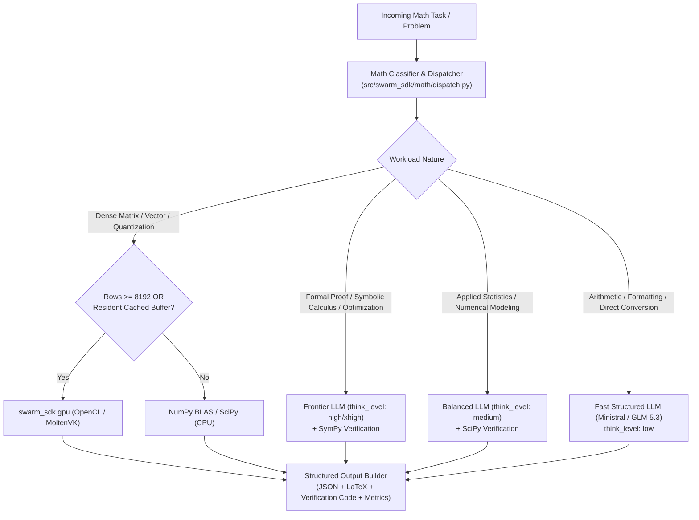

# Math Expert Agent Design Specification

## 1. Executive Summary & Goals

The LangGraph Swarm SDK contains two complementary but previously disconnected mathematical assets:
1. **Symbolic and Numerical Math Library** (`src/swarm_sdk/math/__init__.py`): Implements formal definitions and SymPy equation objects for BM25, RRF, cosine similarity, stable softmax, INT8 quantization, and Hamming distance mappings.
2. **OpenCL GPU Acceleration** (`src/swarm_sdk/gpu/opencl_math.py`): High-performance OpenCL kernels with resident buffer caching and transparent NumPy BLAS fallbacks.

Meanwhile, the existing `ModelDelegate/MathWorker` (`Agents/ModelDelegate/MathWorker/AGENTS.md`) was a minimal 46-line dispatcher that could only select between OpenCL and a single low-effort LLM (Mistral Ministral). It possessed no ability to ingest mathematical problems, perform symbolic derivations, verify proofs computationally, or return structured mathematical results. Furthermore, its dispatch heuristic ("matrices > 256x256") contradicted actual hardware profiling.

### Key Objectives
- Transform `ModelDelegate/MathWorker` into a first-class **Math Expert Agent** capable of both **analytical reasoning** (derivations, proofs, LaTeX, Python verification) and **hardware-accelerated numerical dispatch** (OpenCL GPU vs. CPU NumPy BLAS).
- Ground dispatch heuristics in measured hardware performance: respect the 8,192 row crossover threshold (`_gpu_threshold()`) for ad-hoc matrix transfers while leveraging GPU buffer caching for resident stores.
- Provide a unified execution and verification interface in `src/swarm_sdk/math/` adhering to the repository's `MathRole` template standard.
- Ensure 100% backward compatibility with existing `ModelDelegate` contracts and test suites.

---

## 2. Architecture & Decision Flow

---

## 3. Component Specifications

### 3.1 Mathematical Engine (`src/swarm_sdk/math/dispatch.py`)
A dedicated dispatch and classification module implementing:
- `classify_math_task(task_type: str, shape: tuple[int, ...] | None, has_cache_key: bool) -> MathDispatchDecision`
- Heuristics:
  - If `force_gpu` or `SWARM_GPU_BACKEND` is set and shape satisfies crossover (>= 8192 rows or `has_cache_key=True`): route to `opencl` / `molten`.
  - Dense matrix operations below 8,192 rows without resident buffers: route to `numpy` (CPU BLAS is measurably faster due to PCIe transfer overhead).
  - Pure arithmetic or structured numeric extraction: route to `mistral:ministral-3-8b-latest` (`think_level: low`).
  - Applied statistics, parameter estimation, curve fitting: route to `gpt-4o-mini` / `gemini-3.8-flash` (`think_level: medium`).
  - Symbolic calculus, theorem proving, constrained non-linear optimization: route to `claude-sonnet` / `gemini-pro` (`think_level: high` or `xhigh`).

### 3.2 Agent Contract (`Agents/ModelDelegate/MathWorker/AGENTS.md`)
The contract is expanded to support two distinct modes:
1. **Mode `dispatch`**: Backward-compatible delegation decision (`selected_route`, `gpu_enabled`, `backend`, `notes`).
2. **Mode `solve`**: End-to-end mathematical problem solving:
   - Problem formulation with explicit domain and boundary conditions.
   - Step-by-step analytical derivation.
   - Final closed-form or numerical result formatted in LaTeX.
   - Computational verification script (NumPy, SciPy, or SymPy) with precision bounds (epsilon).

### 3.3 Agent Manifest (`Agents/ModelDelegate/MathWorker/agent.yaml`)
- Tasks:
  - `delegate_math`: Dispatch numerical/linear-algebra tasks.
  - `solve_math`: Formal analytical derivation and proofs.
  - `verify_math`: Computational validation of mathematical claims.
- Capabilities: `gpu_math`, `symbolic_math`, `numerical_optimization`, `statistical_analysis`, `proof_verification`.
- Token budget: `max_prompt: 4096`, `max_completion: 2048`.

---

## 4. Verification & Testing Strategy

1. **Unit Tests for Math Dispatcher**:
   - Threshold tests: matrix 256x256 goes to NumPy; matrix 10000x1024 goes to OpenCL.
   - Resident buffer test: matrix 1024x1024 with `cache_key` goes to OpenCL.
   - Symbolic verification test: BM25 and softmax SymPy representations round-trip against numerical implementations.
2. **Model Delegation Suite Integration**:
   - `Agents/benchmark/Tasks/model_delegation/test_model_delegation.py`: verifies that existing tests pass and new dispatch heuristics adhere to registry routes.
3. **Repository Quality Gate**:
   - `pytest Agents/benchmark`, `ruff`, `ty check`, `swarm_sdk.agents.validate`.
